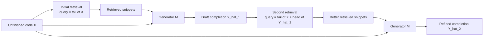

# RepoCoder

RepoCoder 这篇论文的核心想法是：**repository-level code completion 不能只看当前文件，也不能只做一次普通 RAG；更有效的做法是先让模型生成一个草稿 completion，再用这个草稿反过来改进检索 query，最后重新生成。**

如果只记一句话：RepoCoder 是一种 **iterative retrieval-generation** 框架。它把代码模型第一次生成出来的“未必正确但长得像目标代码”的预测，当作下一轮检索的 query expansion，用来从仓库里找更接近目标 completion 的代码片段。

这篇论文对 coding agent / context pruning 的启发是：**模型的中间预测不一定要直接作为最终答案，它也可以作为更好的检索意图表达。** 在代码任务里，unfinished code 往往只描述“问题发生前的上下文”，而不描述“接下来应该写什么”。RepoCoder 的聪明之处就是用生成模型先补出一个 target-shaped query，再让检索器去仓库里找相似实现、API 用法、命名风格和参数模式。

## 基本信息

| 字段 | 内容 |
| --- | --- |
| 来源 | arXiv:2303.12570v3 |
| 标题 | RepoCoder: Repository-Level Code Completion Through Iterative Retrieval and Generation |
| 作者/机构 | Fengji Zhang, Bei Chen, Yue Zhang, Jacky Keung, Jin Liu, Daoguang Zan, Yi Mao, Jian-Guang Lou, Weizhu Chen / City University of Hong Kong, Microsoft, Wuhan University |
| 会议 | EMNLP 2023 main |
| 日期 | 2023-10-20 |
| 链接 | https://arxiv.org/abs/2303.12570 |
| 代码/Benchmark | https://github.com/microsoft/CodeT/tree/main/RepoCoder |
| 相关 topic | [[application/rag/context-compression|Context Compression]] |

## 研究问题

真实软件开发里的代码补全不是 isolated file completion。一个仓库里经常存在：

- 自定义 API、helper、配置对象和注册机制；
- 重复或近似重复的调用模式；
- 项目内部命名规范、参数顺序和代码风格；
- 分散在不同文件里的示例用法。

所以 repository-level code completion 的目标是：给定当前文件里还没写完的代码 `X`，模型不仅要利用 in-file context，还要利用整个 repository 中有用的代码片段，生成目标 completion `Y`。

困难在于：**当前未完成代码 `X` 不一定是好的检索 query。**

例如当前文件只写到某个函数调用前，`X` 里可能没有目标 API 的完整名称、参数、调用模式。普通 RAG 会用 `X` 去检索仓库，结果可能只找到“前文相似”的代码，而不是“接下来应该写的代码”。这就是论文说的 retrieval context 和 intended completion target 之间的 gap。

## 核心直觉：先生成，再用生成结果去检索

RepoCoder 的关键判断是：

> 第一次生成的代码可能是错的，但它通常比 unfinished code 更像目标 completion。

这个判断很重要。模型第一次预测里可能会出现：

- 目标 API 名称的近似形式；
- 参数数量和参数类型的猜测；
- 项目内部对象名或方法名；
- 代码结构，比如 `if`、`return`、函数调用、异常处理。

这些内容即使不完全正确，也能把检索 query 从“当前前缀”拉向“目标代码形状”。下一轮检索就更可能找到仓库里真正的 API signature、相似调用点或同类函数实现。

可以把 RepoCoder 看成一个小循环：



这里的 draft completion 不是最终可信答案，而是一个 **retrieval handle**。这和 coding agent 里的“先假设、再查证”很像：模型先猜一个方向，再用仓库里的真实代码把这个方向校准。

## 方法形式化

### In-File Completion

最朴素的代码补全只看当前文件前文：

$$
\hat{Y} = M(X)
$$

其中：

| 符号 | 含义 |
| --- | --- |
| `X` | 当前文件中 completion 之前的 unfinished code |
| `M` | 预训练代码生成模型 |
| `\hat{Y}` | 模型生成的 completion |

这个 baseline 的问题是：它看不到仓库里其他文件的实现细节。

### Vanilla RAG

普通 retrieval-augmented code completion 先把仓库切成代码片段：

$$
C_{\text{repo}} = \{c_1, c_2, \cdots\}
$$

然后用 unfinished code `X` 检索相关片段：

$$
C_{\text{ret}} = R(C_{\text{repo}}, X)
$$

最后把 retrieved snippets 和 `X` 一起放进 prompt：

$$
\hat{Y} = M(C_{\text{ret}}, X)
$$

这一步已经比 in-file completion 强很多，但它仍然有 query mismatch：`X` 往往描述的是 completion 前的上下文，而不是 completion 本身。

### RepoCoder

RepoCoder 在第 `i > 1` 轮时，不再只用 `X` 检索，而是把上一轮生成结果 `\hat{Y}^{i-1}` 加进 query：

$$
C_{\text{ret}}^i = R(C_{\text{repo}}, X, \hat{Y}^{i-1})
$$

再生成新结果：

$$
\hat{Y}^i = M(C_{\text{ret}}^i, X)
$$

论文实现里，第 `i` 轮检索 query 由两部分拼接：

| 部分 | 作用 |
| --- | --- |
| `X` 的最后 `S_w - S_s` 行 | 保留当前局部上下文 |
| 上一轮预测 `\hat{Y}^{i-1}` 的前 `S_s` 行 | 引入目标 completion 的形状 |

对 line/API completion，论文设置：

| 参数 | 值 | 含义 |
| --- | ---: | --- |
| `S_w` | 20 行 | sliding window size |
| `S_s` | 10 行 | sliding size / 从预测中取的行数 |
| `K` | 10 | 最多放入 prompt 的 retrieved snippets 数 |
| max generation tokens | 100 | line/API completion |

对 function body completion，`S_w` 调到 50 行，max generation tokens 调到 500。

## 检索器：简单但够用

RepoCoder 没有依赖复杂静态分析，也没有训练一个专用 retriever。主实验用的是 sparse bag-of-words retriever：

1. 用 sliding window 遍历 repository 中的代码文件；
2. 把每个 window 当作候选代码片段；
3. 把 query 和候选片段都转成 token set；
4. 用 Jaccard similarity 排序：

$$
\text{Jaccard}(S_q, S_c)=\frac{|S_q \cap S_c|}{|S_q \cup S_c|}
$$

这点反而很有意思：RepoCoder 的主要收益不是来自 retriever 多强，而是来自 **query 被上一轮 generation 改写得更接近目标代码**。

Appendix 里也测试了 UniXcoder dense retriever，结论是 dense retriever 和 sparse retriever 表现接近，趋势一致。这说明这篇论文的核心贡献确实是 iterative retrieval-generation 这个框架，而不是某个检索模型本身。

## Prompt 构造

RepoCoder 的 prompt 由两类内容组成：

| 内容 | 作用 |
| --- | --- |
| retrieved code snippets | 提供仓库级上下文、API 示例、命名风格 |
| unfinished code `X` | 指定当前补全位置和局部语义 |

每个 retrieved snippet 会附带原始 file path。这个设计很实用，因为文件路径本身就是一种弱语义信号：同目录、同模块、相似文件名、相似 import 都可能影响模型判断。

论文没有把重点放在 prompt engineering 上，这也是它的一个 limitation。实际落地时，prompt 模板、snippet 排序、路径展示格式、是否保留 imports / enclosing function / class signature，都可能明显影响效果。

## RepoEval Benchmark

论文同时提出了 RepoEval，用来评估 repository-level code completion。这个 benchmark 的价值不小，因为当时 repo-level completion 缺少标准评测。

RepoEval 的 repository 选择标准：

- GitHub 开源仓库；
- 创建时间晚于 2022-01-01，用来降低 GPT-3.5-Turbo 和 CodeGen 训练数据泄漏风险；
- 非 fork 原创仓库；
- 超过 100 stars；
- Python 文件比例超过 80%；
- 有显式 unit tests。

RepoEval 包含三个粒度：

| 子任务 | 样本数 | 目标 | 评估 |
| --- | ---: | --- | --- |
| Line Completion | 1600 | 补全一行代码 | Exact Match, Edit Similarity |
| API Invocation Completion | 1600 | 补全仓库内部 API 调用 | Exact Match, Edit Similarity |
| Function Body Completion | 373 | 补全 3 到 30 行函数体 | Unit test Pass Rate |

API Invocation Completion 特别值得看，因为它更接近 repo-level 场景的痛点：第三方库和 Python 内置 API 往往出现在预训练数据里，但仓库内部 API 的签名、参数顺序、调用约定，需要从当前 repository 里找。

Function Body Completion 用 unit tests 做执行评估，比 EM/ES 更可靠。论文自己也提到，line/API 任务里很多 EM 判错的预测其实功能上可能是对的，所以 execution-based evaluation 对代码生成更合理。

## 主要实验结果

### Line / API Completion

主实验用了 GPT-3.5-Turbo 和 CodeGen-Mono 6B / 2B / 350M。结果很清楚：RepoCoder 显著强于 In-File，也稳定强于单轮 RAG。

以 GPT-3.5-Turbo 为例：

| 任务 | In-File EM | RAG / Iter-1 EM | RepoCoder Iter-2 EM | Oracle EM |
| --- | ---: | ---: | ---: | ---: |
| Line Completion | 40.56 | 55.31 | 56.81 | 57.75 |
| API Invocation Completion | 34.06 | 47.69 | 49.19 | 50.13 |

几个重点：

- 单轮 RAG 已经带来很大提升，说明 repository context 本身很有价值；
- Iter-2 继续提升，说明上一轮生成结果确实改善了检索；
- Iter-2 接近 Oracle，说明“用预测扩展 query”在不少情况下能逼近“用 ground truth 扩展 query”的效果；
- CodeGen-350M 加上 RepoCoder 后，能接近 GPT-3.5-Turbo 的 In-File baseline，说明检索到正确 repo context 可以部分弥补生成模型规模差距。

### Function Body Completion

Function Body Completion 更难，因为要生成多行代码并通过 unit tests。论文只用 GPT-3.5-Turbo 测这个任务：

| 方法 | Pass Rate |
| --- | ---: |
| In-File | 23.32 |
| RAG / Iter-1 | 38.34 |
| RepoCoder Iter-2 | 42.63 |
| Oracle | 42.63 |

这个结果很漂亮：Iter-2 的 pass rate 达到 Oracle 水平。当然要注意，这里的 Oracle 是在相同 retriever/generator 条件下，用 ground truth 前几行构造 query 的 upper bound，不是理论最优代码补全。

## 为什么有效：检索质量决定补全质量

论文专门分析了 retrieved code quality。最有帮助的 snippet 通常包含：

- 和目标 completion 相似的代码语句；
- 目标 API 的使用示例；
- 相同项目里的参数模式；
- 类似文件或同目录文件里的实现。

他们构造了一个 GT-Code baseline：用静态分析找出其他文件里包含 ground truth API invocation 的 snippet，再放进 prompt。这个 baseline 通常最好，说明“找到真实 API 用法示例”确实能提升补全。

RepoCoder 的 Iter-2 相比 Iter-1 对 ground truth API invocation example 的 recall 更高。而且生成模型越强，Iter-2 的 recall 越高。这个现象支持了论文的核心假设：

> 更强的模型会生成更有用的草稿；更有用的草稿会形成更好的检索 query；更好的检索结果再反过来提升最终生成。

这其实是一个正反馈循环，但它不是无风险的。后面 limitation 里会看到，这个循环也可能把错误放大。

## Retrieved Snippets 来自哪里

论文把有效 retrieved snippets 的来源分成几类：

| 位置 | 含义 |
| --- | --- |
| Imported | target file 直接 import 的文件 |
| Current File | target file 中 completion 位置之外的内容 |
| Current Directory | 同目录文件 |
| Similar Import | 和 target file 有相同 API import 的文件 |
| Similar Name | 文件名 token 相似的文件 |
| Others | 其他位置 |

分析发现，有效 snippet 不只是来自直接 import 文件。很多来自 Current Directory、Similar Import、Similar Name。这对 coding agent 很有启发：**repo-level retrieval 不应该只沿着 import graph 走。** 代码库里的相似任务、相似命名、同目录约定，有时比静态依赖关系更能说明“这里应该怎么写”。

论文还做了一个限制检索范围的 ablation：只从上述位置检索反而性能下降。这说明粗暴收窄搜索范围可能会漏掉有用样例，简单全仓库相似检索在这个任务里反而很稳。

## 和 Context Pruning 的关系

RepoCoder 严格来说不是 pruning paper，它更像 repository-level RAG / retrieval-augmented code completion。但对 coding-agent context pruning 很有参考价值。

### 1. 先检索也是一种“避免无关上下文进入 prompt”

Context pruning 常常是在工具输出已经产生后做压缩，比如 [[SWE-Pruner]] 和 [[Squeez]]。RepoCoder 的位置更靠前：它先从整个仓库里挑出最相关 snippets，再把这些 snippets 放进 prompt。

所以它不是压缩已有上下文，而是控制 **哪些仓库上下文有资格进入 prompt**。

### 2. Query 比 Retriever 更关键

RepoCoder 的 sparse retriever 很简单，但效果仍然强，说明在代码库任务里 query formulation 可能比 retriever architecture 更关键。

对 coding agent 来说，这可以迁移成：

```text
不要只用原始 issue / 当前文件前缀检索；
让 agent 先生成一个目标形状的假设、伪 patch、API 调用草稿或 Goal Hint；
再用这个 target-shaped query 去搜索仓库。
```

这和 SWE-Pruner 的 Goal Hint 有内在相似性：两者都是让模型显式表达“我现在想找什么”。区别是：

| 方法 | query 来源 | 用途 |
| --- | --- | --- |
| RepoCoder | 上一轮 completion draft | 改善 repository retrieval |
| SWE-Pruner | agent 当前阅读目标 Goal Hint | 裁剪 tool observation |
| Squeez | focused query | 从 mixed-format tool output 中抽取原文 span |

### 3. 草稿可以服务于检索，而不是直接提交

RepoCoder 给了一个很实用的范式：**draft-first, verify-through-retrieval**。

在 coding agent 里，这可以对应：

- 先生成可能的 patch shape；
- 用 patch 中的函数名、错误类型、参数名去检索真实代码；
- 用检索结果修正 patch；
- 再运行测试验证。

这样做比直接相信第一版 patch 更稳，也比只用 issue text 检索更贴近代码修改目标。

## 局限与失败模式

### 1. 仍然依赖相似度检索

RepoCoder 的核心机制虽然是 iterative retrieval-generation，但底层仍然是 similarity-based retrieval。也就是说，它能不能帮上忙，很大程度取决于仓库里是否存在和目标 completion 足够相似的代码片段、API 调用样例或命名模式。

论文 Appendix C 也验证了这一点：RepoCoder 对 code duplication 或相似调用模式比较敏感。代码重复率高的仓库通常收益更大，例如 `diffusers` 的提升明显；而 `rl`、`vizier` 这类重复率低的仓库收益较小。

这个局限说明 RepoCoder 本质上还是在回答：**仓库里有没有相似样例可以借鉴？** 它没有真正理解 repository 的语义依赖、控制流、数据流或设计意图。如果目标代码需要组合多个不相似的上下文、理解跨模块协议，或者生成仓库里没有先例的新逻辑，单靠相似度检索就会变弱。

不过，这个相关性也不是绝对的。相同重复率的仓库可能有不同提升，因为“重复”不等于“任务相关示例可检索”。真正重要的是：相似代码是否包含目标 API 用法、参数模式和局部实现结构。

### 2. 没有系统考虑上下文粒度

RepoCoder 评测了不同 completion target 的粒度：line completion、API invocation completion 和 function body completion。但它没有把 **context selection / pruning granularity** 当作核心问题来分析。

具体来说：

| 维度 | RepoCoder 的处理 | 问题 |
| --- | --- | --- |
| 任务粒度 | 评测 line / API / function body completion | 这是 completion target 粒度，不是上下文选择粒度 |
| 检索粒度 | 用固定行数 sliding window 切代码 | 可能切断函数、类、控制流或变量定义 |
| 函数级结构 | 没有 function-aware / AST-aware chunking | retrieved snippet 可能缺少 enclosing function、class、imports |
| 行级裁剪 | 没有像 SWE-Pruner 那样做 line-level retain/prune | 不能在长 snippet 内进一步过滤无关行 |
| token-level 压缩 | 没有讨论 | 不是 prompt compression 论文的方向 |

所以 RepoCoder 解决的是 **query mismatch**：unfinished code 不适合当检索 query，于是用 draft completion 改写 query。它没有解决 **granularity mismatch**：检索回来的 snippet 到底应该是 token、line、fixed segment、function、class 还是 AST block。

这个问题会带来两个风险：

- fixed sliding window 太短时，可能只拿到相似调用行，却缺少变量来源、函数签名、import、配置或 surrounding control flow；
- fixed sliding window 太长时，又会把大量无关代码带进 prompt，造成 token 浪费和注意力噪声。

因此，RepoCoder 可以看作一个很好的 query formulation baseline，但不是一个完整的 code context pruning 方案。后续如果把它接到 coding agent 场景，更合理的方向可能是：

```text
target-shaped query
=> retrieve function / AST / semantic blocks
=> inside block 做 line-level pruning
=> 必要时再做 token-level compression
```

### 3. 迭代次数不是越多越好

RepoCoder Iter-2 通常比 Iter-1 好，但 Iter-3 / Iter-4 不一定继续提升。论文 Appendix D 统计发现，每一轮都会：

- 修复上一轮错的样本；
- 也弄坏上一轮对的样本。

失败原因主要有两个：

- retrieved snippet 误导模型，比如相同 API 在不同文件里有不同参数用法；
- 上一轮 prediction 本身含噪，固定截取前几行做 query 可能把错误代码也放进检索条件。

所以 RepoCoder 需要一个 stopping criterion，但论文没有很好解决。现实系统里可以考虑用 confidence、检索结果稳定性、draft 差异、测试反馈或 static checker 来决定是否继续迭代。

### 4. 有延迟成本

每多一轮就多一次 retrieval 和 generation。对 IDE 实时补全来说，延迟很敏感。论文提到可以通过缓存、预处理仓库、模型量化/蒸馏、动态选择迭代轮数来优化，但没有系统展开。

这也是它和 coding agent 场景的差别：coding agent 可以接受秒级搜索和 patch 验证，但 IDE autocomplete 往往需要更低延迟。

### 5. Prompt 和检索策略探索不足

论文主要验证了 iterative framework，对 prompt template、snippet 排序、结构化代码 chunk、AST-aware retrieval、symbol graph retrieval 等没有深入探索。

这留下了不少后续空间：

- 检索时带上 enclosing function / class / imports；
- snippet 粒度从 sliding window 换成 AST block；
- 用 symbol graph 或 call graph 做候选召回；
- 用 reranker 判断 snippet 是否真的支持当前 completion；
- 用 static analysis 检查生成结果是否匹配 API signature。

## 我对这篇的理解

RepoCoder 的创新点不是“RAG 对代码补全有用”，这个结论比较直觉；它真正有意思的是：**把生成模型的不确定输出变成检索器的输入**。

这件事看起来有点反常，因为我们通常会觉得错误 prediction 会污染系统。但 RepoCoder 说明，在 repo-level code completion 里，prediction 即使不完全正确，也可能携带足够多的目标形状信息，让检索器找到更真实的仓库证据。

所以这篇可以总结成一个范式：

```text
unfinished context is not enough
=> generate a target-shaped draft
=> retrieve repository evidence with the draft
=> regenerate with grounded evidence
```

对 coding agent 来说，这个范式可以扩展成：

```text
issue / traceback / partial file is not enough
=> generate a hypothesis or patch sketch
=> search repo for confirming or contradicting evidence
=> revise patch with retrieved evidence
=> run tests
```

也就是说，RepoCoder 把“先猜一下”从危险的最终行为，变成了有用的检索策略。只要后面有真实仓库代码和测试来校准，这个猜测就不是 hallucination 的终点，而是 search 的起点。

## 论文图表摘录


*RepoCoder Figure 1: iterative retrieval-generation 与普通 RAG / in-file completion 对比*


*RepoCoder Table 2: line / API completion 主结果*


*RepoCoder Table 3: function body completion 结果*

## 相关知识链接

- [[application/rag/retrieval|Retrieval]]
- [[application/rag/context-compression|Context Compression]]
- [[application/rag/chunking|Chunking]]
- [[application/agents/compression|Agent Compression]]
