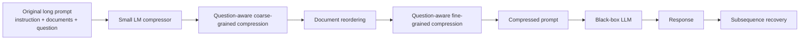
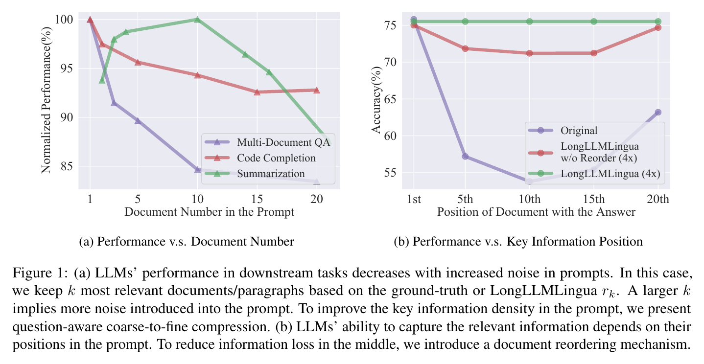
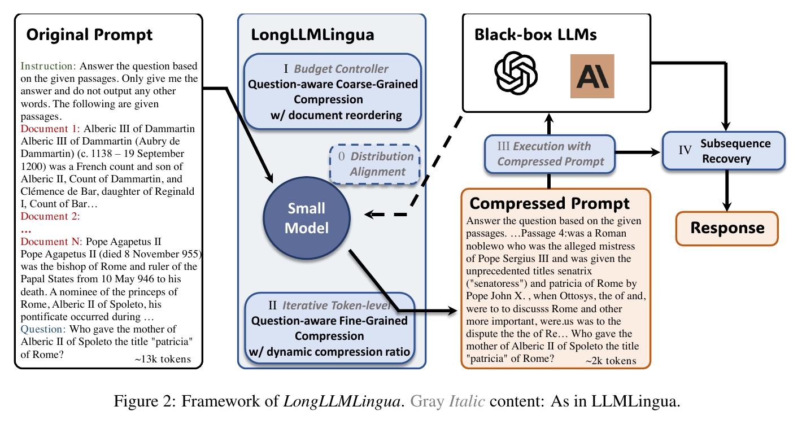
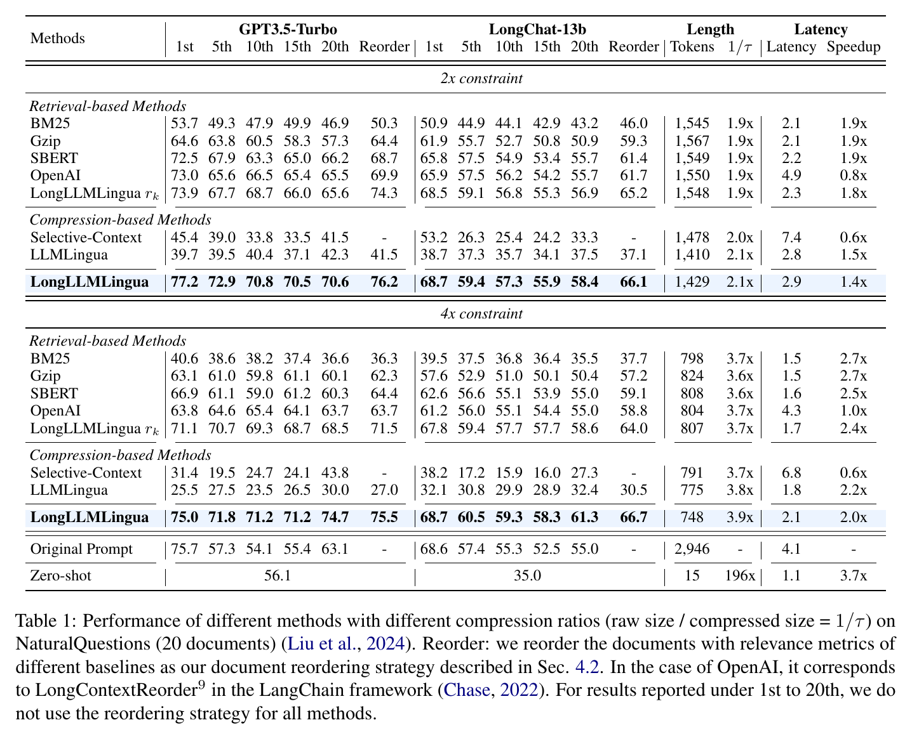

# LongLLMLingua

LongLLMLingua 的 motivation 是：**长上下文不只是贵，还会因为噪声和位置偏置让模型表现变差；所以 prompt compression 的目标不应只是少 token，而是让 key information density 更高，并把关键信息放到模型更容易利用的位置。**

如果只记一句话：LongLLMLingua 是一个面向长上下文的 **question-aware coarse-to-fine prompt compression** 方法。它用一个小语言模型先判断哪些文档/段落更可能回答当前 question，再在这些内容内部做 token-level compression，并通过 document reordering 缓解 lost-in-the-middle，通过 subsequence recovery 修复实体和连续片段被 token 级压缩破坏的问题。

它对 code agent compression 的价值在于提供了一组通用上下文压缩原则：**query-aware、coarse-to-fine、adaptive budget、position-aware、recovery-aware**。但它不是 code-specific 方法，直接迁移到代码时会遇到语法、缩进、函数边界和依赖关系被 token-level 删除破坏的问题。

## 基本信息

| 字段 | 内容 |
| --- | --- |
| 来源 | arXiv:2310.06839v2 |
| 标题 | LongLLMLingua: Accelerating and Enhancing LLMs in Long Context Scenarios via Prompt Compression |
| 作者/机构 | Huiqiang Jiang, Qianhui Wu, Xufang Luo, Dongsheng Li, Chin-Yew Lin, Yuqing Yang, Lili Qiu / Microsoft |
| 日期 | 2024-08-12 |
| 链接 | https://arxiv.org/abs/2310.06839 |
| Code | https://aka.ms/LongLLMLingua |
| 相关 topic | [[application/rag/context-compression|Context Compression]], [[application/rag/retrieval|Retrieval]], [[fundamentals/information-theory/perplexity|Perplexity]] |

## 研究问题

长上下文场景里，用户常把很多文档、检索结果、历史对话、工具输出或示例一起塞进 prompt。即使目标 LLM 支持更大的 context window，也会遇到三个问题：

| 问题 | 表现 | 对系统的影响 |
| --- | --- | --- |
| 计算成本高 | prompt token 越多，prefill latency、API 费用、显存占用越高 | 请求变慢、成本升高 |
| 噪声稀释 | 无关文档和冗余句子占据上下文 | 模型更难聚焦答案证据 |
| 位置偏置 | key information 在 prompt 中间时更容易被忽略 | 出现 lost in the middle |

Figure 1 给出两个关键经验现象：

- 随着 prompt 中文档数量增加，下游任务表现下降，说明更多上下文会带来更多噪声；
- 当包含答案的文档位于 prompt 中间时，LLM accuracy 明显下降，而 LongLLMLingua 加 reordering 后更稳定。

所以论文要解决的不是“怎样让模型接受更长输入”，而是：

```text
给定一个长 prompt 和当前 question，
如何用小模型把 prompt 压缩成更短、更高信息密度、位置更友好的输入，
并让黑盒 LLM 在更低成本下保持或提升表现？
```

## 问题形式化

论文沿用 LLMLingua 的形式，把 prompt 表示为：

$$
x = (x^{ins}, x^{doc}_1, \ldots, x^{doc}_K, x^{que})
$$

其中：

| 符号 | 含义 |
| --- | --- |
| $x^{ins}$ | instruction |
| $x^{doc}_1,\ldots,x^{doc}_K$ | 多个文档、段落或上下文片段 |
| $x^{que}$ | 当前 question |
| $\tilde{x}$ | 压缩后的 prompt |
| $y, \tilde{y}$ | 原 prompt 与压缩 prompt 下 LLM 的输出 |

压缩目标可以写成：

$$
\min_{\tilde{x}} D_{\phi}(y, \tilde{y}) + \lambda \lVert \tilde{x} \rVert_0
$$

直观含义是：压缩后 prompt 越短越好，但压缩后的输出 $\tilde{y}$ 不能偏离原 prompt 输出 $y$ 太多。

LongLLMLingua 在这个目标上多加了一个重要自由度：不仅选择 token 子序列，还允许对文档顺序做 permutation。也就是说，它同时在问两个问题：

1. 哪些内容该保留？
2. 保留内容应该放在 prompt 的什么位置？

## 为什么原始 LLMLingua 不够

LLMLingua 的基本思想是用小语言模型估计 token perplexity：低 perplexity token 更容易预测，可能信息量较低，可以删除；高 perplexity token 更可能携带信息，应保留。

这个思路在短 prompt 或 demonstration compression 中有用，但长上下文 QA 有几个额外困难：

- **question relevance 稀疏**：一个文档平均 perplexity 高，不代表它能回答当前 question。
- **整文档打分会被噪声稀释**：答案可能只在一两句话里，文档里大量背景文字会冲淡信号。
- **统一压缩率不合理**：相关文档应该保留更多 token，无关文档可以压得更狠。
- **位置本身影响模型利用**：即便保留了答案文档，如果它落在中间，模型仍可能忽略。
- **token 级删除会破坏实体**：人名、地名、专有名词被切碎后，模型可能输出拼写错误或半截实体。

LongLLMLingua 的方法就是围绕这些问题对 LLMLingua 做长上下文增强。

## 方法总览

Figure 2 展示了整体 pipeline：



灰色斜体模块来自 LLMLingua：budget controller、iterative token-level compression 和 distribution alignment。LongLLMLingua 新增或强化的是：

| 模块 | 作用 |
| --- | --- |
| Question-aware coarse-grained compression | 先在文档级找 question-relevant 文档 |
| Document reordering | 把重要文档放到更利于 LLM 感知的位置 |
| Question-aware fine-grained compression | 在 token 级保留与 question 更相关的内容 |
| Dynamic compression ratio | 给不同文档分配不同压缩预算 |
| Subsequence recovery | 用原 prompt 连续片段修复压缩后输出中的实体/片段破坏 |

## 机制 1：Question-Aware Coarse-Grained Compression

粗粒度阶段要给每个文档 $x^{doc}_k$ 打分，判断它是否值得进入后续压缩。一个直接办法是计算：

$$
p(x^{doc}_k \mid x^{que})
$$

但论文认为这不够好，因为整篇文档本身有大量无关内容，文档级 perplexity 不一定能突出答案相关性。

LongLLMLingua 反过来问：

```text
给定这个文档，小模型能不能更好地生成 question？
```

它用 question 和一个 restrictive statement 组成 $x^{que,restrict}$，再计算文档对 question 的条件 likelihood：

$$
r_k = -\frac{1}{N_c}\sum_i \log p(x^{que,restrict}_i \mid x^{doc}_k)
$$

其中 restrictive statement 类似：

```text
We can get the answer to this question in the given documents.
```

这个附加语句的作用是把“小模型是否能从文档解释 question”约束成“答案可由给定文档得到”，降低小模型自己幻觉式解释 question 的风险。

这一步的本质不是普通 retrieval 相似度，而是 **document-to-question likelihood**：一个文档越能支持生成当前 question，它越可能包含回答所需信息。

## 机制 2：Document Reordering

Figure 1(b) 说明了 position bias：答案文档在第 1 个位置时效果最好，落到第 10 / 15 个位置时性能明显下降。这和 lost-in-the-middle 现象一致。

因此 LongLLMLingua 在 coarse-grained compression 后，用文档重要性分数重新排列文档，让更重要的文档处在模型更容易利用的位置。

这点很容易被低估：context compression 不只是集合选择问题，也是布局问题。

```text
bad framing:
  keep useful evidence, but bury it in the middle

better framing:
  keep useful evidence, then place it where the model can use it
```

对 agent 来说，这对应一个很实际的原则：保留下来的证据不应随便堆在 prompt 里，最关键的 traceback、函数签名、测试失败点或 patch constraint 应该靠近生成位置。

## 机制 3：Question-Aware Fine-Grained Compression

细粒度阶段要在保留下来的文档内部做 token-level compression。普通 perplexity 只问：

```text
这个 token 在上下文中是否容易预测？
```

LongLLMLingua 改成问：

```text
question 的加入是否改变了这个 token 的重要性？
```

论文定义 contrastive perplexity：

$$
s_i =
\operatorname{ppl}(x_i \mid x_{<i})
-
\operatorname{ppl}(x_i \mid x^{que}, x_{<i})
$$

直观理解：

- 如果一个 token 与 question 相关，加入 question 条件后，它的可预测性分布会发生明显变化；
- 如果一个 token 只是文档里的普通背景信息，question 条件对它影响较小；
- 因此 $s_i$ 可以作为 token 是否 question-relevant 的信号。

论文在 Appendix A 推导了这个指标与 conditional pointwise mutual information 的关系。简化地说，contrastive perplexity 在近似衡量：

```text
这个 token 对生成/解释当前 question 有多大帮助？
```

这比纯 token perplexity 更适合长上下文 QA，因为答案相关 token 未必全局罕见，但它们对当前 question 有条件相关性。

## 机制 4：Dynamic Compression Ratio

LLMLingua 原本更像给不同 segment 使用相对统一的 compression budget。LongLLMLingua 认为这不适合长上下文，因为不同文档的 question relevance 不同。

因此它把 coarse-grained 阶段得到的文档重要性分数传给 fine-grained 阶段：

- 更相关的文档：分配更多 token budget，压缩更保守；
- 更不相关的文档：分配更少 token budget，压缩更激进。

论文用线性 scheduler 根据文档 rank 分配每个文档的压缩率，大意是：

$$
\tau_i = \tau^{doc}_k,\quad x_i \in x^{doc}_k
$$

也就是属于同一文档的 token 共享该文档的预算。这样 coarse selection 和 fine compression 不再是两个割裂步骤，而是形成了 budget allocation 链路。

这个设计对后续代码压缩方法很重要：压缩不是“所有文件都删到同样比例”，而是要把 token budget 花在和当前任务最相关的结构上。

## 机制 5：Subsequence Recovery

强 token-level compression 容易破坏实体。例如一个人名、地名或专有名词在 compressed prompt 里被切成奇怪片段，LLM 生成时可能复制这些碎片，导致输出拼写错误。

LongLLMLingua 的 subsequence recovery 是一个后处理步骤：

1. 在 LLM response 中找出也出现在 compressed prompt 里的连续片段；
2. 回到 original prompt 里找到对应的原始连续片段；
3. 用原始 prompt 中更完整的 subsequence 替换 response 中的压缩片段。

它的作用不是提升理解能力，而是修复压缩造成的 surface-form corruption，尤其适合人名、机构名、标题、数字等需要原样保真的内容。

在代码场景里，这个思想很有启发：如果压缩破坏了变量名、函数名、路径、行号或 traceback 片段，后处理 recovery 可能比让模型“猜回去”更可靠。

## 实验设置

论文用小模型做 compression controller，用黑盒或较大的目标 LLM 执行任务。

| 项目 | 设置 |
| --- | --- |
| Compression small LM | LLaMA-2-7B-Chat |
| Target LLM | GPT-3.5-Turbo-0613 / GPT-3.5-Turbo-16k-0613, LongChat-13B-16k |
| 解码 | greedy decoding, temperature 0 |
| 主要数据集 | NaturalQuestions multi-document QA, LongBench, ZeroSCROLLS, MuSiQue, LooGLE |
| Baselines | BM25, Gzip, SentenceBERT, OpenAI embedding, Selective-Context, LLMLingua |

评测关注两件事：

1. **Effectiveness**：压缩后性能是否保持或提升；
2. **Efficiency**：token 数、latency、speedup 是否改善。

## 实验结果怎么读

### 1. NaturalQuestions：压缩可以同时提效和提质

Table 1 是最核心的表。它在 NaturalQuestions 20-document QA 上比较不同方法，在 2x 和 4x compression constraint 下的表现。

几个关键读法：

- 原始 prompt 在 GPT-3.5-Turbo 上并不稳定：答案文档在第 1 位时 75.7，但在第 10 位时只有 54.1，体现 lost in the middle。
- LongLLMLingua 在 2x constraint 下，GPT-3.5-Turbo 的 1st/5th/10th/15th/20th 分别是 77.2/72.9/70.8/70.5/70.6，比原始 prompt 的中间位置稳定得多。
- 在 4x constraint 下，LongLLMLingua 仍能保持 75.0/71.8/71.2/71.2/74.7，并且 reordering 后达到 75.5。
- LLMLingua 和 Selective-Context 在这个任务上掉得很明显，说明不 question-aware 的 token compression 容易留下噪声或删掉答案证据。
- LongLLMLingua 在 4x constraint 下把 token 从约 2,946 压到 748，并有约 2.0x latency speedup。

论文特别强调一个结果：当答案文档在第 10 个位置时，LongLLMLingua 在 NaturalQuestions 上相对原 prompt 有明显提升，同时输入 token 约少 4 倍。这说明压缩不是单纯省钱，有时也是去噪和重新组织上下文。

### 2. LongBench：跨任务仍然有效，但不是所有任务同等收益

Table 2 在 LongBench 上比较 3,000 token constraint 和 2,000 token constraint。LongBench 覆盖 single-doc QA、multi-doc QA、summary、few-shot、synthetic、code 等类别。

关键现象：

- 原始 prompt 平均分是 44.0；
- LongLLMLingua 在 3,000 token constraint 下平均分 48.8，约 3x compression，latency speedup 1.6x；
- 在 2,000 token constraint 下平均分 48.3，约 6x compression，latency speedup 2.6x；
- code 类别上也有一定提升：原始 prompt 54.2，LongLLMLingua 在 3,000 / 2,000 token 下分别是 55.2 / 56.7。

但这个 code 结果不能直接说明它适合 code agent。LongBench 的 code completion 更接近长 prompt 代码任务，不等于真实 agent 的多轮工具输出、文件跳转、测试反馈和 patch 证据管理。

### 3. Ablation：question-aware coarse-grained 最关键

Table 3 的 ablation 很重要。以 NaturalQuestions 2x constraint 为例：

| 变体 | 现象 |
| --- | --- |
| w/o Question-awareness | 性能大幅下降，说明只用信息熵/普通 perplexity 不够 |
| w/ SBERT | 比完整方法弱，说明 embedding relevance 不能替代该 paper 的 question-aware likelihood |
| w/o Question-aware Fine-grained | 有下降，说明 token 级也需要 question conditioning |
| w/o Dynamic Compression Ratio | 有下降，说明统一压缩率不如按文档重要性分配 budget |
| w/o Subsequence Recovery | 有下降，说明表层实体恢复有帮助 |
| w/ Document Reordering | 不同 answer position 下结果更一致，说明 reordering 确实缓解位置偏置 |

作者的结论是：LongLLMLingua 的收益不是某一个 trick 单独带来的，而是 coarse selection、fine compression、dynamic budget、reordering 和 recovery 共同作用。

## 和 Agent Compression 的关系

LongLLMLingua 不是为 code agent 设计的，但它给 agent compression 提供了几条非常有用的抽象原则。

### 1. 压缩目标是 key information density

agent 不应该只问“怎么少 token”，还要问：

```text
压缩后，单位 token 里有多少能支持当前决策的证据？
```

在 coding agent 中，这意味着保留 traceback 关键行、失败断言、相关函数签名、调用点和 patch constraints，而不是机械保留最近读过的文件。

### 2. 压缩必须 task-aware

LongLLMLingua 的 question-aware 对应到 code agent 里就是 goal-aware / issue-aware / test-aware。

同一段代码在不同任务下重要性不同：

- 修 bug 时，失败测试和相关分支更重要；
- 补 API 时，函数签名和调用约定更重要；
- 做 refactor 时，类型定义、跨文件调用和 invariants 更重要。

因此 agent compression 不能只靠全局 PPL 或通用相似度。

### 3. Coarse-to-fine 是正确结构

LongLLMLingua 先选文档，再压 token。代码场景也应该先按结构选：

```text
repo / file / class / function / block / line
```

再在保留结构内部细粒度压缩。后续 [[sources/papers/2025-longcodezip-compress-long-context-for-code-language-models|LongCodeZip]] 把这个思想改成 code-specific 的 function-level 和 block-level selection。

### 4. 位置也是上下文管理

LongLLMLingua 的 document reordering 提醒我们：保留证据不等于模型会用证据。agent prompt 里，越接近当前生成/决策位置的信息越容易被用到。

对 coding agent 来说，关键证据可以按这种顺序组织：

```text
current task -> failing evidence -> relevant code slice -> constraints -> secondary context
```

而不是按工具调用时间顺序把所有 observation 追加到底。

### 5. Recovery 对代码尤其重要

Subsequence recovery 在自然语言里主要修复实体；在代码里可能更关键，因为代码对 surface form 更敏感：

- 变量名不能半截；
- import 路径不能错；
- line number 不能被压坏；
- traceback / assertion message 需要原样保留；
- 函数签名和类型注解最好保持完整。

所以代码压缩不能只追求语义摘要，还要保留可执行/可定位的原文证据。

## 局限与疑问

### 1. 不是 code-specific compression

LongLLMLingua 主要面向自然语言长上下文和多文档 QA。它的 token-level deletion 对 prose 比较自然，但对代码可能破坏：

- 缩进和 block 边界；
- 函数签名；
- 变量定义和使用关系；
- import / module path；
- 控制流条件；
- 注释与代码的对应关系。

因此它不能直接替代 LongCodeZip、CodePromptZip、SWE-Pruner、Squeez 这类更贴近代码结构或 agent observation 的方法。

### 2. Perplexity 仍然只是 proxy

Contrastive perplexity 比普通 perplexity 更 question-aware，但它仍然是 proxy。它近似衡量 token 与 question 的条件相关性，不等于最终任务收益。

在 code agent 里，更好的监督信号可能来自：

- unit test pass/fail；
- static analysis；
- type checking；
- patch apply success；
- issue reproduction；
- LLM judge 对证据充分性的判断。

### 3. Reordering 依赖 relevance estimation

如果文档重要性估计错，reordering 会把错误证据放到高注意力位置，反而更容易误导模型。

所以 reordering 不是无条件收益，它依赖前面的 coarse-grained scorer 足够可靠。

### 4. Subsequence recovery 不等于语义恢复

Subsequence recovery 能修复实体表面形式，但不能恢复被删除掉的推理链、因果关系或代码依赖。它是 surface-form repair，不是完整 information recovery。

### 5. 压缩也可能掩盖不确定性

高压缩比下，如果压缩器错误删除了关键证据，目标 LLM 可能仍然生成流畅答案。系统层面需要保留“压缩失败/证据不足”的检测机制，而不是只看输出是否自然。

## 关键结论

LongLLMLingua 的核心贡献不是提出一个更强的 retriever，而是把 long context compression 从“删 token”推进到“围绕当前 question 重组证据”：

- 用 question-aware document scoring 提高 key information density；
- 用 contrastive perplexity 保留与 question 条件相关的 token；
- 用 dynamic compression ratio 把预算分配给更重要的文档；
- 用 document reordering 缓解 lost in the middle；
- 用 subsequence recovery 修复 token-level compression 破坏的实体和连续片段。

对 agent compression 来说，它是通用长上下文压缩的一个重要基线：它说明 **压缩、选择、排序和恢复应该一起考虑**。但它还没有解决 code agent 的核心难点：代码结构不能随意破坏，工具输出需要证据级保真，多轮 agent 还需要处理记忆更新、观察去重、证据充分性和任务状态。

## 论文图表摘录



*LongLLMLingua Figure 1: 噪声文档数量与关键信息位置对性能的影响*



*LongLLMLingua Figure 2: 框架总览*



*LongLLMLingua Table 1: NaturalQuestions 压缩结果*

## 相关知识链接

- [[application/rag/context-compression|Context Compression]]
- [[application/rag/retrieval|Retrieval]]
- [[fundamentals/information-theory/perplexity|Perplexity]]
- [[application/agents/compression|Agent Compression]]
