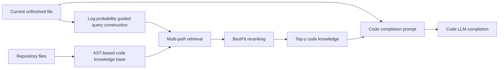

# CodeRAG

CodeRAG 这篇论文的 motivation 很直观：repository-level code completion 里的 RAG 不能只问“哪些代码相关”，还要问“哪些代码对当前 code LLM 真正好用”。它把问题拆成三问：

1. **怎么去问？** 当前 unfinished code 不一定是好 query，最后几行也不一定包含真正线索。
2. **怎么去搜？** 单一路径 retrieval 只能覆盖一种相关性，代码任务同时需要 lexical、semantic 和 dependency 线索。
3. **相关是否等于好用？** retriever 觉得相关的代码，不一定能帮助最终 code LLM 生成正确 completion。

对应地，CodeRAG 提出三种方案：

1. 用小模型做 log probability guided probing：哪个 local chunk 让模型对 target completion 更有 confidence，就更适合作为 query context。
2. 用 sparse、dense、dataflow 三条路径一起搜，覆盖关键词、语义相似和依赖链条。
3. 用 BestFit reranking 从候选里选“最好用”的知识：先用 BestFit prompting 做局部选择，再通过 sliding window + heap sort 把这些局部选择组织成近似 top-`u` 排序/筛选过程。

如果只记一句话：CodeRAG 是一个面向仓库级代码补全的 RAG 框架，它用 **log probability guided probing** 构造更好的检索 query，用 **multi-path retrieval** 同时覆盖 keyword / semantic / dataflow 三类相关性，再用 **preference-aligned BestFit reranking** 把检索结果重排成更符合 code LLM 偏好的必要知识。

这篇论文对 coding agent / context pruning 的启发是：**上下文选择不是单一检索器的问题，而是 query 表达、候选召回和模型偏好对齐三个环节共同决定的。** 对代码任务尤其如此，因为“当前光标前的最后几行”常常不是最好的检索意图表达；同一个补全点可能既需要同名 API 的精确匹配，也需要语义相似实现，还需要沿着变量或调用关系找到依赖代码。

## 基本信息

| 字段 | 内容 |
| --- | --- |
| 来源 | arXiv:2509.16112v1 |
| 标题 | CodeRAG: Finding Relevant and Necessary Knowledge for Retrieval-Augmented Repository-Level Code Completion |
| 作者/机构 | Sheng Zhang, Yifan Ding, Shuquan Lian, Shun Song, Hui Li / Xiamen University, Ant Group |
| 日期 | 2025-09-19 |
| 链接 | https://arxiv.org/abs/2509.16112 |
| 代码 | https://github.com/KDEGroup/CodeRAG |
| 相关 topic | [[application/rag/context-compression|Context Compression]], [[sources/papers/2023-repocoder-repository-level-code-completion|RepoCoder]] |

## 研究问题

仓库级代码补全的目标是：给定当前文件中光标前的 unfinished code，从整个 repository 中找出有用信息，辅助 code LLM 生成后续代码。

论文认为现有 repository-level code completion 方法主要有三个问题：

| 问题 | 含义 | 会导致什么 |
| --- | --- | --- |
| P1: 怎么去问 | 用最后 `k` 行，或用最后 `k` 行加上一轮生成结果做 query | query 没抓住真正线索。比如关键 import、class 定义、全局变量在文件前面，最后几行看不到，检索器就找不到正确 API 用法 |
| P2: 怎么去搜 | 只用 sparse / dense / dataflow 中的一类检索路径 | 只能找到一种“相关”。比如 sparse 擅长同名 API，但找不到语义相似代码；dataflow 能找变量依赖，但不一定能找相似实现 |
| P3: 相关不一定好用 | retriever 认为相关的片段，不一定是 code LLM 生成时真正需要的片段 | 检索结果看起来相关，但模型补全时用不上。它们会占掉上下文窗口，反而把真正有帮助的片段挤出去 |

这个问题非常贴近 context pruning：上下文窗口里不是“相关信息越多越好”，而是要找 **relevant and necessary knowledge**。CodeRAG 的标题里同时强调 relevant 和 necessary，正是这篇论文的关键区分。

## 方法总览

CodeRAG 的 pipeline 可以拆成五步：



这五步分别对应：

| 步骤 | 作用 |
| --- | --- |
| code knowledge base construction | 用 AST 把仓库代码转成结构化知识项 |
| retrieval query construction | 回答“怎么去问”：用小模型 confidence 找到最适合 target chunk 的 local context，并和 target chunk 拼成 query |
| multi-path retrieval | 回答“怎么去搜”：同时做 sparse、dense、dataflow-guided retrieval |
| preference-aligned BestFit reranking | 回答“相关不一定好用”：用 LLM reranker 按生成任务偏好挑出更必要的代码知识 |
| retrieval-augmented completion | 把 top-u 知识和当前代码上下文放入 code LLM |

## Code Knowledge Base：按代码结构切，而不是按长度切

普通 RAG 经常按长度、分隔符或固定 chunk 切文本。但代码不是普通文本：如果把 class、function 或变量定义切碎，可能破坏语义结构。

CodeRAG 用 AST 构建 code knowledge base，主要抽取四类元素：

| 知识类型 | 例子 | 价值 |
| --- | --- | --- |
| functions | `def func(*args): ...` | 函数签名、调用约定、返回逻辑 |
| global variables | `VAR_CONST = "test"` | 配置常量、模块级状态 |
| class functions | `class MyClass: def method(self): ...` | 类方法、对象 API |
| class variables | `self.name = ""` | 对象字段、初始化状态 |

这一步的直觉是：**代码知识库的基本单位应该尽量保留程序结构。** 对仓库级补全来说，一个完整函数、一个类方法或一个变量定义，往往比任意 20 行窗口更可解释。

## Query Construction：用 log probability 找“让模型更有信心”的上下文

很多 RAG 方法把当前光标前的最后 `k` 行当 query。CodeRAG 认为这太粗：真正影响补全的代码可能在当前文件更早的位置，比如 import、全局变量、class definition、helper function。

CodeRAG 的做法是 **log probability guided probing**：

1. 把当前 unfinished file 切成细粒度 chunk，每个 chunk 有 `f` 行；
2. 找到包含光标位置的 target chunk；
3. 对每个非 target chunk，把它和 target chunk 拼接，喂给一个小 code LLM；
4. 让小模型生成 `m` 个 token，记录每一步 vocabulary 中最高 token 的 log probability；
5. 把 `m` 步 log probability 求和，作为这个 chunk 对 target chunk 的 relevance / confidence score；
6. 选出 top-`g` chunk，和 target chunk 拼成最终 retrieval query。

论文默认参数：

| 参数 | 值 | 含义 |
| --- | ---: | --- |
| `f` | 3 | 每个细粒度 chunk 的行数 |
| `g` | 1 | 选入 query 的高分 chunk 数 |
| prober LLM | CodeT5p-220m | 用于 log probability probing 的小模型 |

这个方法的核心判断是：

> 如果把某个 chunk 加到 target chunk 前后，code LLM 对接下来 token 的预测更有信心，那么这个 chunk 可能对当前补全更有用。

这和 RepoCoder 的思路不一样。RepoCoder 用上一轮生成结果扩展 query，把 query 拉向目标 completion 的形状；CodeRAG 则在当前文件里主动探测哪些已有 chunk 能提高模型预测信心，把 query 拉向更有用的 local context。

## Multi-path Retrieval：三种相关性都要

CodeRAG 同时使用三条检索路径：

| 路径 | 使用方式 | 擅长场景 |
| --- | --- | --- |
| Sparse Retrieval | TF-IDF keyword matching | 同名变量、同名 API、相似 token 或调用模式 |
| Dense Retrieval | CodeT5p-220m 编码，cosine similarity | 语义相似但字面 token 不完全重合的代码 |
| Dataflow-Guided Retrieval | 对 unfinished file 建 dataflow graph，从最后未完成行沿依赖关系检索 | 变量实例化、对象来源、依赖链条 |

论文默认 sparse 和 dense 各取 `j = 15` 个结果；如果 dataflow graph 中存在依赖，再加入 dataflow-guided retrieval 的结果。因此候选列表大约是 `2j + 1` 个代码知识片段。

这一步的意义在于：**代码相关性不是一种东西。**

例如：

- 如果 query 里出现 `T5Config.from_pretrained`，sparse retrieval 很可能直接找到相似调用；
- 如果 query 是“build search engine”，dense retrieval 更容易找到语义相关的 retriever 函数；
- 如果补全依赖 `model.select_model(...)` 里的 `model` 来源，dataflow-guided retrieval 更容易沿变量依赖找到 `ModelProvider`。

单一路径各有盲区，多路径召回能先把候选池做宽。

## BestFit Reranking：从相关代码里找必要代码

多路径 retrieval 会带来候选，但候选顺序不一定适合 code LLM。CodeRAG 用 reranker 解决 P3：retriever 的相关性目标和 generator 的补全目标不一致。

论文尝试的不是 listwise reranking，而是 **BestFit prompting**。它让 LLM reranker 只回答：

```text
Which of the retrieved code snippets is most helpful for completing the following code snippet?
```

也就是在一个候选窗口里选出“最有帮助”的代码片段，而不是生成完整排序列表。

这样做有两个好处：

| 设计 | 好处 |
| --- | --- |
| 只选 best fit | 输出短，推理成本低，不需要生成长排序 |
| 小模型也能遵循 | 论文用 Qwen3-8B 作为 LLM reranker，不依赖在线大模型 API |

为了处理长候选列表，CodeRAG 使用 sliding window + heap sort。这里的关键不是让 reranker 一次性输出完整排序，而是把“局部最好用”的选择逐步组织成一个近似 top-`u` 排序/筛选过程：

1. 把 retrieval list 划成多个窗口，相邻窗口共享一个 code knowledge；
2. 每次把一个窗口喂给 LLM reranker，让它选最有帮助的片段；
3. 把被选中的片段视作当前局部窗口里的 best fit；
4. 用 heap sort 的交换/上浮思路不断把这些局部 best fit 往列表前面组织；
5. 最后得到一个近似 top-`u` 的候选排序，只保留前 `u` 个作为最终上下文。

论文默认 `u = 10`。

这一步可以理解成：retrieval 负责 **recall**，BestFit reranking 负责 **selection under generator preference**。它解决的是“相关片段很多，哪些最可能被生成模型用上”的筛选问题，而不是证明这些片段一定能让最终大模型生成正确答案。

## Distilled Reranker：把 LLM reranker 的偏好蒸馏给小模型

Qwen3-8B reranker 仍然有推理成本，所以论文又训练了一个 distilled reranker。

蒸馏数据构造流程：

1. 用训练集中的 unfinished code 构造 retrieval query；
2. 做 multi-path retrieval 得到初始候选列表；
3. 随机从候选列表中抽取不同数量的 code knowledge，形成多个候选集合；
4. 对每个候选集合，用 BestFit prompting 调 Qwen3-8B reranker 重复选择 5 次；
5. 如果某个候选至少 4 次被选中，就把 `{query, candidates, selected_candidate}` 作为高置信蒸馏样本。

训练时使用：

| 项 | 内容 |
| --- | --- |
| backbone | Qwen3-0.6B |
| tuning | LoRA |
| loss | token-level cross entropy |

这个设计有一个值得记的点：它没有把所有 LLM reranker 输出都当标签，而是只保留 **selection consistency** 高的样本。也就是说，蒸馏的不是一次随机选择，而是 LLM reranker 较稳定的偏好模式。

## 实验设置

### Benchmark

| Benchmark | 样本 | 特点 |
| --- | ---: | --- |
| ReccEval | 6,461 | Python；PyPI 项目；发布时间在 2023-01-01 到 2023-04-28 |
| CCEval | 2,665 | 多语言 cross-file code completion；论文实验用 Python subset |

### Generator

论文用四个不同规模的 code LLM 做 generator：

| 模型 | 参数量 |
| --- | ---: |
| CodeGen | 350M |
| SantaCoder | 1.1B |
| StarCoder2 | 3B |
| Qwen2.5-Coder | 7B |

生成设置里，maximum generation tokens 是 48，temperature 是 0，默认 maximum input length 是 2,048。

### Baselines

| 方法 | 关键思路 |
| --- | --- |
| Zero-Shot | 只用光标前代码，不用 repository 信息 |
| CCFinder | 基于 import 关系检索 2-hop context |
| RG-1 | 标准 sparse RAG，用 unfinished code 做 query |
| RepoCoder | iterative retrieval-generation，用上一轮生成结果改进 query |
| DraCo | dataflow-guided retrieval |
| RepoFuse | 融合 analogy context 和 rationale context |
| RepoFormer-3B | 自判断是否需要 retrieval 的 code LLM |

## 主要结果

### ReccEval：CodeRAG 全模型规模领先

在 ReccEval 100% test 上，CodeRAG 使用 LLM reranker 时，在四个 generator 上都取得最好结果。

| Generator | 最强 baseline EM | CodeRAG EM | 提升 |
| --- | ---: | ---: | ---: |
| CodeGen-350M | RepoCoder 23.96 | 26.81 | +2.85 |
| SantaCoder-1.1B | DraCo 30.27 | 36.17 | +5.90 |
| StarCoder2-3B | DraCo 36.57 | 42.69 | +6.12 |
| Qwen2.5-Coder-7B | DraCo 39.99 | 47.48 | +7.49 |

更大的 generator 上，CodeRAG 的收益反而更明显。一个合理解释是：强 code LLM 更能利用 reranked code knowledge，也更能从多路径检索结果里吸收正确 API 用法和依赖关系。

Qwen2.5-Coder-7B 上的 ReccEval 结果尤其清楚：

| 方法 | Code EM | Code ES | Identifier EM | Identifier F1 |
| --- | ---: | ---: | ---: | ---: |
| Zero-Shot | 11.48 | 47.72 | 18.37 | 36.43 |
| RG-1 | 33.01 | 61.55 | 40.15 | 54.68 |
| RepoCoder | 34.99 | 62.71 | 42.38 | 56.20 |
| DraCo | 39.99 | 66.26 | 48.55 | 63.41 |
| RepoFuse | 38.24 | 65.11 | 45.88 | 60.11 |
| CodeRAG | 47.48 | 70.82 | 55.47 | 68.68 |

这说明 CodeRAG 不只是提升 exact string match，也提升 identifier match。对 repository-level completion 来说，identifier match 很重要，因为仓库内部 API 名称、变量名、类名通常是最难靠预训练记住的部分。

### CCEval：跨文件 API 场景同样有效

CCEval 100% evaluation 上，CodeRAG 仍然领先。

| Generator | 最强 baseline EM | CodeRAG EM |
| --- | ---: | ---: |
| CodeGen-350M | DraCo 12.83 | 14.11 |
| SantaCoder-1.1B | DraCo 19.70 | 22.89 |
| StarCoder2-3B | DraCo 26.68 | 30.66 |
| Qwen2.5-Coder-7B | DraCo 30.69 | 35.20 |

这对论文主张是重要补充，因为 CCEval 的样本要求 completion statement 至少使用一个 cross-file API，更能体现仓库级上下文检索的价值。

## 消融实验

### 多路径 retrieval 确实有用

Table 3 对比了不同 retrieval path 和 reranker 组合。总体趋势是：

- sparse / dense / dataflow 单独使用都有帮助；
- 组合更多 retrieval path 通常更好；
- 加上 LLM reranker 后提升非常明显。

以 StarCoder2-3B 为例：

| Variant | Code EM | Identifier F1 |
| --- | ---: | ---: |
| CodeRAGs | 33.83 | 57.18 |
| CodeRAGd | 32.81 | 56.55 |
| CodeRAGdf | 35.13 | 60.15 |
| CodeRAGdf+s | 39.85 | 64.01 |
| CodeRAGdf+s+d | 40.52 | 64.83 |
| CodeRAGdf+s+d+lr | 42.69 | 65.73 |

这里可以看到，dataflow + sparse + dense 已经很强，但 reranker 还能继续把 EM 从 40.52 推到 42.69。

### Log probability query construction 强于 last-k lines

Table 5 在 Qwen2.5-Coder-7B + sparse retrieval 下比较 query construction。

| Query 方法 | Code EM | Code ES | Identifier F1 |
| --- | ---: | ---: | ---: |
| Jaccard 选 chunk | 33.54 | 61.89 | 55.33 |
| last 1 line | 32.08 | 61.04 | 54.91 |
| last 3 lines | 34.84 | 62.85 | 56.97 |
| last 5 lines | 34.21 | 62.26 | 56.04 |
| last 10 lines | 32.95 | 61.48 | 54.93 |
| CodeRAG log-prob query | 35.01 | 63.11 | 57.24 |

last-k lines 里，`k=3` 最接近 CodeRAG，但仍低于 log probability guided probing。这个结果支持 P1：不是简单拿更多最近上下文就更好，query 应该按对补全的实际帮助来构造。

### Distilled reranker 比 LLM reranker 弱，但仍有竞争力

在 ReccEval 30% test 上，CodeRAGdistilled reranker 相比 CodeRAGllmr 有下降，但仍强于大部分 baselines。

| Generator | CodeRAG LLM reranker EM | CodeRAG distilled reranker EM |
| --- | ---: | ---: |
| CodeGen-350M | 27.73 | 23.58 |
| SantaCoder-1.1B | 35.83 | 32.65 |
| StarCoder2-3B | 43.31 | 39.88 |
| Qwen2.5-Coder-7B | 47.57 | 44.34 |

这说明蒸馏 reranker 是一个实际部署上的折中：牺牲一部分排序质量，换更低的推理成本。

### Top-u 不是越多越线性提升

论文比较 `u = 1, 3, 5, 10`。结论是：

- `u` 变大通常提升 code completion；
- 从 1 到 3 的提升明显；
- 从 5 到 10 的提升变小；
- 太多 reranked code knowledge 可能引入边际价值较低的信息。

这和 context pruning 的经验一致：保留更多上下文有帮助，但收益递减，而且后面会被噪声和窗口占用抵消。

## 成本分析

论文报告不含 code LLM 生成时间的平均 query cost：

| 方法 | 平均耗时 |
| --- | ---: |
| RepoCoder | 0.21s |
| DraCo | 0.04s |
| RepoFuse | 0.15s |
| CodeRAG | 0.23s |

CodeRAG 比 RepoCoder 和 RepoFuse 略慢，但差距不大。分步骤看：

| 步骤 | 平均耗时 |
| --- | ---: |
| query construction | 0.14s |
| sparse retrieval | 0.002s |
| dense retrieval | 0.015s |
| dataflow retrieval | 0.03s |
| distilled reranker | 0.06s |

最大成本来自 query construction，也就是 log probability guided probing。论文也提到可以用 batch、parallelization、vLLM、Faiss 和 distilled reranker 进一步加速。

## 人工评估

论文随机抽取 ReccEval 上 100 个 completion case，让三个计算机专业硕士学生评估 LLM reranking 结果质量，分数范围 1 到 5，5 表示最好。

三个评分者平均分分别是：

| Reviewer | Average score |
| --- | ---: |
| Student 1 | 3.69 |
| Student 2 | 3.76 |
| Student 3 | 4.03 |

这个人工评估主要支持一点：BestFit reranking 不只是指标上有效，人看 reranked snippets 时也能感觉顺序更接近“对补全有帮助”。

## 和 RepoCoder 的关系

CodeRAG 和 RepoCoder 都是 repository-level code completion 的 RAG 方法，但核心解决的问题不同。

| 方法 | 主要问题 | 关键机制 |
| --- | --- | --- |
| RepoCoder | unfinished code 不是好 query，因为它不像目标 completion | 先生成草稿，再用草稿扩展下一轮 query |
| CodeRAG | query 构造、检索路径、retriever-generator 对齐都不足 | log probability probing + multi-path retrieval + BestFit reranking |

可以这样理解：

- RepoCoder 更像 **generation-assisted query expansion**；
- CodeRAG 更像 **model-confidence-guided query construction + generator-preference-aligned context selection**。

如果把它们放进 coding agent 的上下文管理里，RepoCoder 的启发是“模型中间输出可以作为检索意图”；CodeRAG 的启发是“上下文选择要让检索器和生成模型偏好对齐”。

## 对 coding agent / context pruning 的启发

### 1. Pruning 前先问：query 是怎么来的？

很多 context pruning 方法默认已有一个 query 或 goal，然后根据这个 query 做压缩。但 CodeRAG 提醒我们：query 本身可能是错的。

对 coding agent 来说，query 可能来自：

- 用户原始任务；
- agent 当前 plan；
- 最近一次 tool call；
- 当前文件光标附近代码；
- agent 自己生成的 hypothesis。

如果 query 表达不准，后续 rerank / prune 再强也可能围着错误意图优化。CodeRAG 的 log probability probing 可以看作一种自动 query diagnosis：哪个局部上下文让模型更确定，就把它纳入 query。

### 2. 单一路径检索很难覆盖代码任务

代码任务至少有三种常见“相关性”：

| 相关性 | 例子 |
| --- | --- |
| lexical relevance | 同一个函数名、变量名、配置 key |
| semantic relevance | 不同命名但做同一类处理 |
| structural / dependency relevance | 变量从哪里来、对象字段在哪里初始化、调用链经过哪里 |

coding agent 的 context pruning 如果只基于 embedding similarity，很容易漏掉精确 identifier；如果只基于 grep / BM25，又容易漏掉语义相似 helper；如果只基于 AST/dataflow，又可能漏掉同类实现示例。

### 3. Reranking 应该对齐最终 consumer

CodeRAG 的 P3 很重要：retriever 觉得相关，不代表 generator 真能用。

在 agent 场景里，最终 consumer 可能是：

- 补全模型；
- patch generation 模型；
- bug localization 模型；
- test failure explanation 模型；
- planner / verifier。

不同 consumer 需要的上下文不同。一个“通用相关性分数”不一定能服务所有步骤。更稳的做法是让 reranker 的判断标准贴近当前 consumer 的任务，比如“哪个 snippet 最能帮助生成 patch？”而不是抽象地问“哪个 snippet 和 query 最相关？”

### 4. Top-k / top-u 是上下文预算问题，不是固定超参问题

CodeRAG 的 top-u 消融说明：更多 reranked snippets 通常有帮助，但边际收益递减。对 agent 来说，`u` 不应该永远固定，可以根据：

- 当前上下文窗口剩余预算；
- snippets 之间是否高度重复；
- reranker score margin；
- 任务阶段是定位、修改还是验证；
- generator 模型大小和上下文利用能力；

动态决定保留多少。

## 局限与疑问

### 1. 仍然没有真正联合训练 retriever 和 code LLM

论文自己也承认，它主要通过 reranker 修改 retrieval results 来缓解 misalignment，并没有更新 code LLM，也没有把 retriever 和 generator 联合训练。因此 P3 只是被减轻，没有被根治。

这会带来一个问题：reranker 判断“最有帮助”的依据来自 LLM reranker，而不是最终 code LLM 的真实 completion success。换句话说，左右帮助的也只是让 reranker 觉得更好用，不一定让真正执行 completion 的大模型也觉得更好用。Qwen3-8B reranker 的偏好和 CodeGen / SantaCoder / StarCoder2 / Qwen2.5-Coder 的生成偏好不一定完全一致。

### 2. Log probability probing 的信号可能偏向“容易预测”

论文把更高 log probability 解释为 chunk 对 target chunk 更有帮助。但另一种可能是：某些 chunk 让模型生成更常见、更模板化的 token，因此 confidence 更高，却不一定更接近 ground truth。

也就是说，log probability 是一个有用 proxy，但它不完全等于 task relevance。尤其在 bug fixing 或复杂 agent 任务里，“让模型更有信心”的上下文未必就是正确上下文。

此外，query construction 阶段用的是 CodeT5p-220m 这样的小模型。小模型的 confidence 不难算，成本也低，但它的判断难免不完全等同于最终大模型的判断：小模型觉得最适合 target 的 local chunk，未必就是大模型最需要的上下文。

### 3. 实验仍主要是 completion，不是完整 agent repair

CodeRAG 的 benchmark 是 ReccEval 和 CCEval，都是 repository-level code completion。它没有直接评估多轮 coding agent、SWE-Bench repair、测试失败定位或 patch verification。

所以把它迁移到 context pruning 时，要小心区分：

- completion：目标通常是补全下一段代码；
- repair：目标是定位原因、理解失败、生成 patch、通过测试；
- agent：目标会随轮次变化，query 和必要上下文也会动态变化。

### 4. AST knowledge base 的语言泛化需要成本

CodeRAG 用 AST 提取 functions、variables、class functions、class variables。这个方向合理，但对多语言仓库来说，需要可靠 parser 和语言特定规则。CCEval 虽然是多语言 benchmark，但论文实验使用 Python subset，因此多语言泛化仍需要进一步验证。

## 论文图表摘录


*CodeRAG Figure 2: framework overview*


*CodeRAG Table 1: ReccEval 主结果*

## 相关知识链接

- [[application/rag/retrieval|Retrieval]]
- [[application/rag/reranking|Reranking]]
- [[application/rag/chunking|Chunking]]
- [[application/rag/context-compression|Context Compression]]
