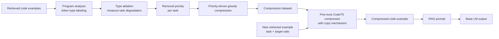

# CodePromptZip

CodePromptZip 这篇论文的核心想法是：**RAG-based coding task 里的 retrieved code examples 很长，但不是所有 code token 都同等重要；与其用通用 prompt compression 方法压自然语言 prompt，不如训练一个 code-specific compressor，专门压缩检索回来的代码示例。**

如果只记一句话：CodePromptZip 是一种 **type-aware + task-aware + copy-enhanced** 的代码示例压缩框架。它先用程序分析工具把代码 token 分成不同类型，再通过 ablation 判断不同 token type 对下游任务质量的影响，构造压缩训练数据；最后微调一个带 copy mechanism 的 CodeT5 compressor，让它按照指定压缩率生成保留关键信息的 compressed code examples。

这篇论文对 coding agent / context pruning 的启发是：**代码上下文压缩不能只看 token 级信息密度，还要看 token 在程序结构和下游任务中的角色。** Identifier、Invocation、Signature、Structure、Symbol 这类 token type 的重要性不是固定的，而是随任务变化；因此 code context pruning 最好是 task-aware 的。

## 基本信息

| 字段 | 内容 |
| --- | --- |
| 来源 | arXiv:2502.14925v2 |
| 标题 | CodePromptZip: Code-specific Prompt Compression for Retrieval-Augmented Generation in Coding Tasks with LMs |
| 作者/机构 | Pengfei He, Shaowei Wang, Tse-Hsun Chen / University of Manitoba, Concordia University |
| 日期 | 2026-04-09 |
| 链接 | https://arxiv.org/abs/2502.14925 |
| 代码/数据 | paper 中给出匿名 replication package：`CodePromptZip-6B2B` |
| 相关 topic | [[application/rag/context-compression|Context Compression]] |

## 研究问题

RAG 在 coding tasks 里很常见：给模型当前 query，再附上从代码库或样例库里检索到的 code examples。问题是这些 retrieved examples 会让 prompt 变得很长：

- prompt 可能达到数万 token；
- 长 prompt 带来 context window 限制、prefill 延迟和 API 成本；
- 检索到的 example 里有很多 token 对当前生成任务帮助不大；
- 通用 prompt compression 方法主要面向自然语言，不一定理解代码 token 的结构角色。

论文要回答的是：

```text
能不能训练一个代码专用 compressor，
只压缩 RAG prompt 中的 code examples，
在减少 token 的同时尽量保留下游 coding task 的生成质量？
```

这里的压缩目标不是压缩 question，也不是压缩整个 prompt，而是压缩：

```text
retrieved code examples
```

压缩后的 prompt 仍然保留原始 query / question，然后把原本的 retrieved examples 换成 compressed examples。

## 问题形式化

论文把一个 coding task 的 prompt 表示为：

$$
x = (x^{code}_1, ..., x^{code}_N, x^{ques})
$$

其中：

| 符号 | 含义 |
| --- | --- |
| `x_i^{code}` | 第 `i` 个 retrieved code example |
| `N` | few-shot / retrieved examples 数量 |
| `x^{ques}` | 当前问题或待完成代码任务 |

CodePromptZip 只压缩 code examples：

$$
\tilde{x}^{code}_i = LM_C(T, \tau_{code}, x^{code}_i)
$$

其中：

| 符号 | 含义 |
| --- | --- |
| `LM_C` | compressor model |
| `T` | 下游 coding task 类型 |
| `tau_code` | 代码示例的目标压缩率 |

最终 compressed prompt 是：

$$
\tilde{x} = (\{LM_C(T, \tau_{code}, x^{code}_i)\}_{i=1}^{N}, x^{ques})
$$

目标是：压缩后 base LM 的输出分布尽量接近未压缩 prompt 的输出分布，同时 token 更少。

我的理解是：这和 LLMLingua 那类方法相比，压缩位置更窄，但也更贴近 RAG coding task 的主要冗余来源。它不尝试理解整个 prompt 的所有内容，而是专门回答“retrieved code example 里哪些 token 可以删”。

## 核心观察：不同 code token type 的重要性不同

CodePromptZip 的第一步不是直接训练模型，而是先问一个更基础的问题：

```text
代码里的不同 token type，对下游生成质量的影响一样吗？
```

论文把代码 token 分成五类：

| Token type | 含义 |
| --- | --- |
| Symbol | 运算符、分隔符、括号、分号等符号 |
| Signature | 方法声明、参数、接口信息 |
| Invocation | 函数/方法调用，体现依赖和交互 |
| Identifier | 变量名、类名、用户自定义名称 |
| Structure | if、for、class 等控制流或结构 token |

然后用 JavaParser 构造 AST，识别 retrieved code examples 中的 token type，并做 type ablation：

```text
一次删除某一类 token
把 type-ablated examples 放进 RAG prompt
观察下游任务性能下降多少
```

论文定义每个 token type 的 removal priority：

$$
Priority(T) = \frac{\tau_{code/T}}{d_T}
$$

其中：

| 符号 | 含义 |
| --- | --- |
| `tau_code/T` | 删除 type `T` 后获得的压缩比例 |
| `d_T` | 删除 type `T` 导致的性能下降 |

直觉上：

```text
删掉某类 token 能省很多 token，
但性能下降很小，
这类 token 就应该优先删除。
```

这个定义很实用，因为它不是抽象地说哪个 token “重要”，而是用下游任务效果来决定删除顺序。

## 任务相关性：删除优先级不是固定的

论文在三个 RAG-based coding tasks 上做实验：

| 任务 | 输入 | 输出 | 指标 |
| --- | --- | --- | --- |
| Assertion Generation | focal method + partial unit test | assertion statements | Exact Match |
| Bugs2Fix | buggy method | fixed method | CodeBLEU |
| Code Suggestion | method header / summary | suggested code snippet | CodeBLEU |

它用 GPT-3.5-turbo 和 Gemini-1.0-Pro 做 type ablation，发现：

- token type 的 removal priority 在不同 base LM 之间相对一致；
- 但在不同任务之间会变化。

例如论文 Figure 1 里：

| 任务 | 高优先删除倾向 |
| --- | --- |
| Assertion Generation | Invocation、Symbol 更靠前 |
| Bugs2Fix | Identifier、Invocation、Structure 更靠前 |
| Code Suggestion | Signature、Symbol 更靠前 |

这个结果说明两个点：

1. **压缩策略可以跨模型迁移**：同一个任务上，GPT-3.5 和 Gemini 对 token type 的敏感性大体一致。
2. **压缩策略必须考虑任务**：Assertion Generation、Bugs2Fix、Code Suggestion 需要保留的信息不同。

我觉得这是论文最有价值的观察之一。它把“代码压缩”从通用 token selection 推向了 **task-conditioned code token selection**。

## 方法总览

CodePromptZip 有两个阶段：



训练阶段：

1. 对某个 task `T`，用 program analysis 得到 token type；
2. 用 ablation 得到每类 token 的 removal priority；
3. 用 greedy algorithm 按优先级删 token，构造 `(原始代码, 目标压缩率, 压缩后代码)` 训练样本；
4. 微调 compressor model。

推理阶段：

1. RAG retriever 找到 code examples；
2. compressor 接收 task、目标压缩率、原始 code example；
3. 输出 compressed code example；
4. 把 compressed examples 拼进 prompt，交给 GPT-3.5 / Gemini / CodeLlama 等 base LM。

## 训练数据构造：priority-driven greedy compression

论文的训练数据不是人工标注，也不是让 GPT-4 生成摘要，而是由 program analysis + task ablation 自动构造。

算法逻辑是：

```text
输入：code example、目标压缩率 tau_code、当前 task 的 token type priority
1. 给每个 token 分配删除优先级
2. 同一 token type 内，高频 token 更优先删除
3. 如果 token 属于多个 type，按最低删除优先级处理，避免误删关键 token
4. out-of-type token 最后删除
5. 按 priority queue 不断 pop token，直到达到目标删除数量
6. 剩下的 token 组成 compressed code example
```

训练数据覆盖 `tau_code = 0.1` 到 `0.9` 的九种目标压缩率。数据规模来自各任务知识库中 parsable examples：

| 任务 | Parsable examples | 训练样本数 |
| --- | ---: | ---: |
| Assertion Generation | 70,433 | 70,433 * 9 |
| Bugs2Fix | 48,903 | 48,903 * 9 |
| Code Suggestion | 89,014 | 89,014 * 9 |

这里有个关键设计：Algorithm 1 本身只能处理 JavaParser 可解析的代码，但训练出的 compressor 是 sequence-to-sequence model，不再依赖每次推理时都能 parse 成 AST。因此它可以处理 incompletely retrieved snippets 或 unparsable code。

## Compressor：带 copy mechanism 的 CodeT5

CodePromptZip 用 CodeT5 作为 compressor backbone，并做了两类增强。

第一类是 special tokens：

| Special token | 用途 |
| --- | --- |
| `<ASSERTION>` / `<BUGS2FIX>` / `<SUGGESTION>` | 指示当前 task |
| `<Ratio>` / `</Ratio>` | 输入目标压缩率 |
| `<Compress>` / `</Compress>` | 标记压缩任务边界 |

这样模型输入不只是代码，还包括：

```text
当前是什么任务？
目标压缩率是多少？
要压缩哪段 code example？
```

第二类是 copy mechanism。

因为 compressed code examples 完全来自原始 code examples，本质上是 extractive compression，不应该鼓励模型自由生成新 token。论文在 CodeT5 decoder 上加入 copy module，让每一步输出在两种分布之间混合：

$$
P(y) = p_{gen}P_{vocab}(y) + (1 - p_{gen})P_{copy}(y)
$$

其中：

| 分布 | 含义 |
| --- | --- |
| `P_vocab` | 从模型词表生成 token |
| `P_copy` | 从输入代码序列复制 token |
| `p_gen` | 当前步选择生成还是复制的门控概率 |

这个机制很符合代码压缩任务：代码里的标识符、方法名、常量、API 调用最好逐字保留，不要被模型“改写成差不多的东西”。对 coding agent 来说，这一点尤其重要，因为一个字符错了就可能完全改变含义。

## 主要实验结果

论文把 CodePromptZip 和四类 baseline 比较：

| 类别 | 方法 |
| --- | --- |
| Entropy-based | LLMLingua, LongLLMLingua |
| Knowledge distillation / compression model | LLMLingua-2, RECOMP |
| Oracle | 直接使用 priority-driven greedy algorithm，不经过 compressor |
| Reference | w/o retrieval, w/o compression |

RQ1 使用 GPT-3.5-turbo 作为 base LM。为了公平，CodePromptZip 设置 `tau_code = 0.3`，让压缩率和 baseline 接近或更高。

### Table 2：三类任务上的结果

| 方法 | Assertion EM | Bugs2Fix CodeBLEU | Code Suggestion CodeBLEU |
| --- | ---: | ---: | ---: |
| w/o retrieval | 23.9 | 41.7 | 14.2 |
| LLMLingua | 42.1 | 21.2 | 23.4 |
| LongLLMLingua | 41.9 | 21.8 | 21.2 |
| LLMLingua-2 | 45.3 | 48.1 | 20.9 |
| RECOMP | 40.9 | 21.0 | 21.7 |
| CodePromptZip w/o Copy | 40.9 | 56.7 | 20.5 |
| CodePromptZip | 42.1 | 61.9 | 23.7 |
| Oracle | 46.2 | 66.8 | 23.8 |
| w/o compression | 50.5 | 81.4 | 24.7 |

论文报告 CodePromptZip 相比 best baseline 分别提升：

| 任务 | 相对 best baseline 提升 |
| --- | ---: |
| Assertion Generation | 23.4% |
| Bugs2Fix | 28.7% |
| Code Suggestion | 8.7% |

这里需要小心读：这些是论文给出的 improvement 口径，不是简单从表格里的绝对分数相减。绝对值上，CodePromptZip 在 Bugs2Fix 的优势最明显，在 Code Suggestion 上更接近 Oracle 和 w/o compression。

### Copy mechanism 的作用

copy mechanism 对结果有稳定帮助：

| 任务 | 加 copy 后提升 |
| --- | ---: |
| Assertion Generation | +1.2% Exact Match |
| Bugs2Fix | +5.2% CodeBLEU |
| Code Suggestion | +3.2% CodeBLEU |

这说明直接从输入复制 token 对代码压缩很重要，尤其是 Bugs2Fix 这种对代码细节敏感的任务。

另一个作用是控制压缩率。论文 Figure 5 显示，带 copy 的 CodePromptZip 更接近指定的 `tau_code`；原始 CodeT5 without copy 更容易偏离目标压缩率。

## RQ2：压缩率和 shots 的 trade-off

论文比较了不同 `tau_code` 和不同 shots 数量：

```text
1-shot / 3-shot / 5-shot
tau_code = 0.1 / 0.3 / 0.5 / 0.7
```

一个重要结论是：

> 在固定 token budget 下，少量但保留更多信息的 examples，通常比更多但压得很狠的 examples 更好。

例如 Assertion Generation 中，在约 500 token budget 下：

```text
1 个 example + tau_code = 0.1
优于
3 个 examples + tau_code = 0.7
```

这个结论对 RAG 很有启发：不是检索更多 examples 再压得很碎就一定好。有时保留一个相对完整的高质量 example，比塞入多个残缺 examples 更有效。

但它不是绝对规律。Appendix 的 Table 6 也显示，随着 shots 增加，压缩 examples 仍然可能带来提升。例如 Code Suggestion 中，增加 compressed examples 数量可以继续提高表现。

所以更准确的判断是：

```text
token budget 固定时，shots 数量和单个 example 完整度之间存在任务相关折中；
CodePromptZip 提供了 tau_code 控制旋钮，但最优点需要按任务调。
```

## RQ4：跨 base LM 迁移

论文还在 CodeLlama-13B 和 Gemini-1.0-Pro 上测试。结果显示 CodePromptZip 在不同 base LM 上通常仍然优于 baseline。

这点很重要，因为 CodePromptZip 的输出是 concrete compressed code，不是 soft prompt 或模型内部向量。因此它可以迁移到不同 reader model，包括：

- GPT-3.5-turbo；
- Gemini-1.0-Pro；
- CodeLlama-13B。

对实际系统来说，这比需要访问目标模型梯度或 hidden states 的方法更容易部署。

## RQ5：处理 unparsable code

论文专门测试了 unparsable code 场景：从 code examples 末尾删掉 1% 或 3% token，让它们无法被 JavaParser 解析。

在 `tau_code = 0.3` 时：

| 场景 | Assertion EM | Bugs2Fix CodeBLEU | Code Suggestion CodeBLEU |
| --- | ---: | ---: | ---: |
| parsable code, CodePromptZip | 42.1 | 61.9 | 23.7 |
| omit 1% at end | 42.0 | 61.9 | 23.9 |
| omit 3% at end | 41.7 | 61.0 | 22.6 |
| Oracle | N/A | N/A | N/A |

这说明：

- 直接基于 AST 的 Oracle 不能处理 unparsable snippets；
- 训练好的 LM compressor 可以处理不完整代码；
- performance drop 较小。

这也是为什么论文没有直接把 Algorithm 1 当最终方法。Algorithm 1 更像是 teacher / data generator，真正部署时用的是 learned compressor。

## 和 LLMLingua / LongLLMLingua 的关系

LLMLingua 和 LongLLMLingua 的基本思路是：用小模型估计 token 信息量，删掉低信息密度内容。它们主要面向自然语言 prompt、长上下文 QA、摘要或通用推理。

CodePromptZip 的不同点在于：

| 维度 | LLMLingua / LongLLMLingua | CodePromptZip |
| --- | --- | --- |
| 压缩对象 | 通用 prompt / 长上下文 | RAG 中的 code examples |
| 重要性依据 | PPL / entropy / key information density | token type + downstream task degradation |
| 是否 task-aware | 相对弱 | 强，按 coding task 建 priority |
| 是否 code-aware | 弱 | 强，使用 program analysis token taxonomy |
| 输出方式 | 删除 token 后的 compressed prompt | copy-enhanced seq2seq 生成 compressed code |
| 适用场景 | 通用长 prompt | RAG-based coding tasks |

我的理解是：CodePromptZip 并不是要替代 LLMLingua，而是把 prompt compression 的通用思想搬到 code RAG 里，并补上代码结构和任务敏感性。

## 和 RepoCoder / Repoformer 的关系

RepoCoder、Repoformer、CodePromptZip 都在处理 RAG-based coding 的上下文问题，但它们的位置不同：

| 方法 | 解决的问题 | 发生位置 |
| --- | --- | --- |
| RepoCoder | unfinished code 不是好 query，如何通过 draft 改善 retrieval | retrieval 前 / retrieval 过程中 |
| Repoformer | 是否应该触发 cross-file retrieval | retrieval admission control |
| CodePromptZip | retrieval 已经拿到 examples 后，如何压缩 code examples | retrieval 后 / prompt 构造前 |

所以三者可以组成一个链条：

```text
Repoformer：这一步要不要检索？
RepoCoder：如果要检索，query 怎么构造得更好？
CodePromptZip：检索回来以后，code examples 怎么压短？
```

从 context pruning 角度看，CodePromptZip 属于 **retrieved-context compression**，不是 agent trajectory compression，也不是 tool observation pruning。

## 和 SWE-Pruner / Squeez 的关系

CodePromptZip 和 SWE-Pruner / Squeez 都属于 code context pruning 大方向，但压缩对象不同：

| 方法 | 压缩对象 | 粒度 | 目标 |
| --- | --- | --- | --- |
| CodePromptZip | RAG retrieved code examples | token type / sequence-to-sequence copy | 保留对 coding task 有用的示例信息 |
| SWE-Pruner | coding agent read tool 返回的代码上下文 | line-level retain/prune | 根据 Goal Hint 裁剪当前 read observation |
| Squeez | mixed-format tool output | verbatim span extraction | 根据 focused query 抽取最小证据块 |

CodePromptZip 的任务更像：

```text
在模型调用前，把 RAG examples 压短。
```

SWE-Pruner / Squeez 的任务更像：

```text
在 agent 工具调用后，把 observation 压短。
```

因此 CodePromptZip 对 coding agent 的间接启发是：如果 agent 的 tool output 是代码，那么 pruning 策略可以考虑 token type 和 task degradation，而不只是按行或按文本相似度筛选。

## 局限与疑问

### 1. 任务需要额外训练

论文明确说，removal priority 依赖 downstream coding task。如果换到 repository-level issue fixing、test failure debugging、API migration、multi-file editing 这类任务，token type 的重要性可能不同，需要重新构造数据和训练 compressor。

这限制了它作为通用 coding agent pruner 的直接适用性。

### 2. 主要实验是 Java + method-level tasks

论文实验集中在 Java 和 method-level tasks。虽然作者认为 Python 等语言也有 program analysis tools，可以迁移，但这仍然需要验证。

特别是 coding agent 场景常见：

- 多文件上下文；
- incomplete snippets；
- build logs / stack traces / diffs；
- shell output；
- markdown / config / JSON / YAML；
- repo-level dependency reasoning。

这些都超出了 CodePromptZip 当前主实验范围。

### 3. 压缩后的代码不一定保持可执行

CodePromptZip 的目标是帮助 base LM 生成答案，不是产生可编译的 compressed code。因此它可以删掉一些语法符号或结构 token。

这对 RAG examples 是可以接受的，因为 examples 只是提示；但如果把它用于 agent 直接阅读代码，可能会带来误解风险。

也就是说：

```text
CodePromptZip 压缩的是示例，不一定适合压缩待修改的真实源文件。
```

### 4. Oracle 依赖 parser，compressor 依赖 parser 生成的数据

最终 compressor 可以处理 unparsable code，但它的训练数据来自 parser 可解析代码上的 priority-driven deletion。这个 teacher signal 是否能覆盖真实 agent observation 里的各种破碎文本，还需要进一步验证。

### 5. RAG retriever 不是研究重点

论文使用 BM25 检索 examples，并明确说改进 retriever 不是本文重点。因此如果 retrieval 本身质量很差，CodePromptZip 只能压缩噪声，不能从根上修复“检索错了”的问题。

这和 RepoCoder / Repoformer 是互补关系。

## 我的判断

CodePromptZip 最值得借鉴的地方不是“又训练了一个 compressor”，而是它提出了一个很清楚的 code compression 视角：

```text
代码 token 的可删除性，应该由 token type 和下游任务效果共同决定。
```

这比简单 PPL / entropy 更贴近代码任务。代码里的 token 有强结构角色：Identifier 承载命名语义，Invocation 承载调用依赖，Signature 承载接口信息，Structure 承载控制流，Symbol 承载语法连接。删哪个不是纯语言模型困惑度能决定的。

不过，CodePromptZip 目前更像 **RAG code example compressor**，还不是完整的 coding agent context pruning 方法。它没有评估多轮 agent trajectory，也没有处理真实工具输出中的 mixed-format observation。但它给 SWE-Pruner / Squeez 这类 observation pruning 提供了一个可借鉴方向：

- pruner 可以显式区分代码 token type；
- 删除策略应该按任务和 reader model 的实际表现校准；
- copy mechanism 对代码压缩很重要，避免模型改写关键 token；
- 压缩率应该是可控参数，而不是压缩器自由决定。

## 论文图表摘录


*CodePromptZip Figure 1: 不同任务下 code token type removal priority*


*CodePromptZip Figure 2: framework overview*


*CodePromptZip Figure 3: CodeT5 copy mechanism*


*CodePromptZip Table 2: 三类 coding tasks 主结果*

## 相关知识链接

- [[application/rag/context-compression|Context Compression]]
- [[application/rag/retrieval|Retrieval]]
- [[application/rag/chunking|Chunking]]
- [[application/agents/compression|Agent Compression]]

## References

- `2502.14925v2.pdf`
- https://arxiv.org/abs/2502.14925
