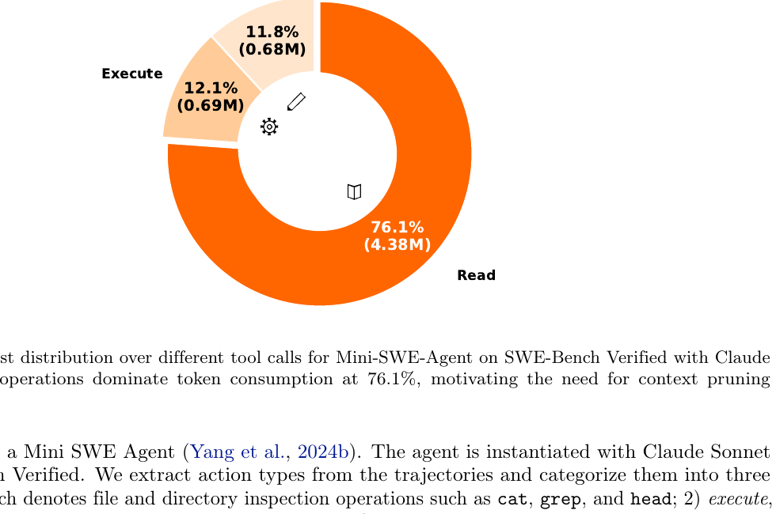
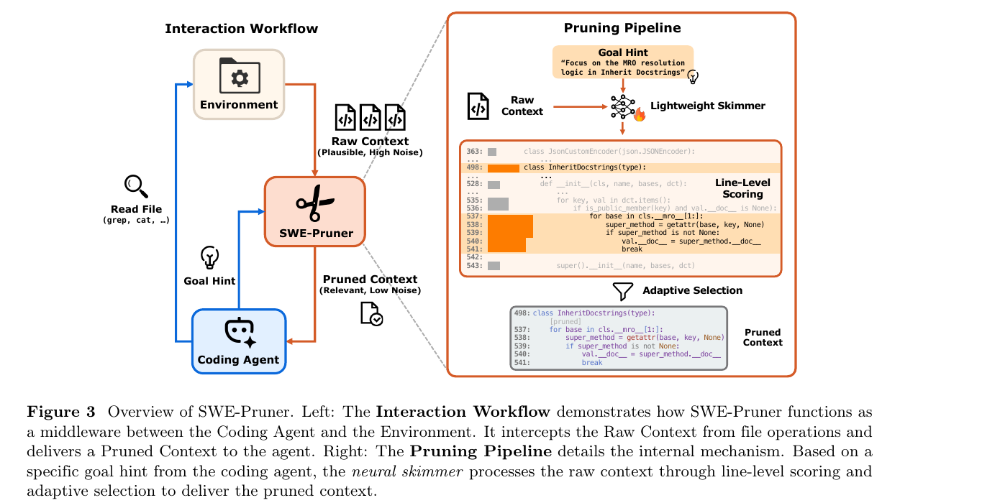
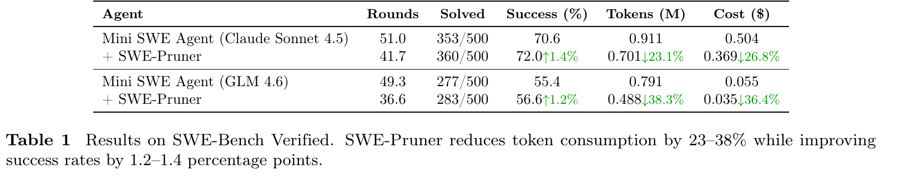
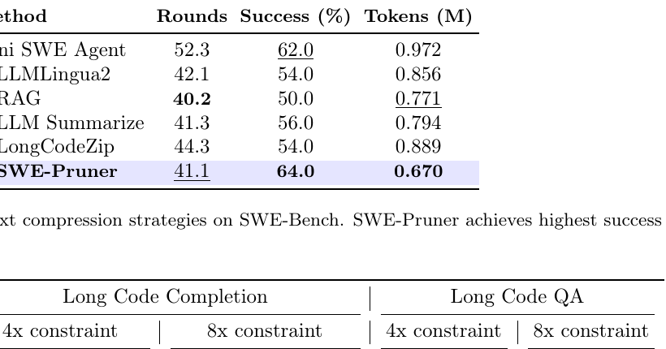

## 基本信息

- Title: [SWE-Pruner: Self-Adaptive Context Pruning for Coding Agents](https://arxiv.org/abs/2601.16746)
- Authors: Yuhang Wang, Yuling Shi, Mo Yang, Rongrui Zhang, Shilin He, Heng Lian, Yuting Chen, Siyu Ye, Kai Cai, Xiaodong Gu
- Institutions: Shanghai Jiao Tong University, Sun Yat-sen University, Douyin Group
- Date: 2026-05-07
- Code: `https://github.com/Ayanami1314/swe-pruner`
- Related topic notes: [[application/rag/context-compression|Context Compression]], [[application/agents/agent|Agent]], [[application/rag/reranking|Reranking]]

这篇论文提出 SWE-Pruner，一个面向 coding agent 的 self-adaptive context pruning 框架。它把上下文压缩放在 agent 与环境之间：当 agent 通过 `cat`、`grep`、读文件等工具拿到大量代码输出时，SWE-Pruner 根据 agent 当前的自然语言目标问题过滤输出，只把任务相关的代码行返回给 agent。

它的核心不是简单减少 token，而是让 agent 在每次观察环境时显式说明“我现在想从这段输出里找什么”。论文把这个目标称为 Goal Hint，也可以实现成工具参数 `context_focus_question`。随后一个轻量 neural skimmer 依据该问题对代码行打分和保留，从而减少长轨迹中的无关代码、历史噪声和 API 成本。

## 研究问题

Coding agent 在真实代码库中解决问题时，会反复搜索、读文件、运行测试和编辑代码。论文对 Mini SWE Agent 在 SWE-Bench Verified 上的轨迹做预分析，发现读文件、搜索和查看目录等 read 操作消耗了总 token 的 76.1%，远高于 execute 和 edit。

这个现象说明，agent 的上下文瓶颈主要来自环境观察，而不只是模型推理历史本身。随着多轮交互推进，早期读到的代码会留在上下文里，不断累积成噪声，导致成本上升、注意力稀释和冗余探索。

已有 prompt compression 方法在代码 agent 场景中有三个不足：

- token-level pruning 容易破坏代码语法、缩进和局部结构；
- abstractive summarization 可能丢失调试所需的字符级细节、变量名和 API 签名；
- 静态压缩比例或困惑度指标不知道 agent 当前到底在找什么，因此无法随任务阶段变化。

SWE-Pruner 要回答的问题是：能否在不重写 agent 架构的情况下，对工具输出做任务感知、结构保留、低延迟的上下文裁剪？

## 核心主张

SWE-Pruner 的核心主张是：代码 agent 的上下文压缩应该发生在 agent-environment boundary，并且由当前任务目标动态驱动。

这与普通 RAG 或离线长代码压缩不同。agent 的信息需求会随轨迹变化：一开始可能需要理解仓库结构，中间需要定位某个类或函数，最后需要检查异常处理、测试失败或边界条件。固定压缩策略无法适应这种变化。

因此，SWE-Pruner 把上下文裁剪设计成三件事的组合：

- agent 生成 self-contained 的 Goal Hint，说明当前观察目标；
- neural skimmer 根据 Goal Hint 和原始工具输出，对每个 token / line 估计相关性；
- 系统以 line-level granularity 返回裁剪结果，尽量保留代码结构和可读性。

## 方法与机制

### Goal Hint / Context Focus Question

SWE-Pruner 修改文件读取类工具接口，为 `cat`、`grep` 等工具增加可选参数 `context_focus_question`。当该参数为空时，工具返回完整输出；当参数存在时，输出会先经过 pruner。

论文强调 Goal Hint 需要是完整、自包含的问题，而不是关键词。例如：

- 好问题：`How is authentication handled?`
- 好问题：`Where is the MRO resolution logic implemented?`
- 坏问题：`load_raw function`
- 坏问题：`lines 50-100 of data_loader.py`

这个设计使压缩逻辑与 agent 的工作流低耦合。原始工具可以保留，只需要在输出返回前加一层 middleware。

### Line-level neural skimmer

SWE-Pruner 把上下文裁剪建模为 query-conditioned reranking / selection。给定代码上下文 $C=\{x_1,\dots,x_n\}$ 和 Goal Hint $q$，模型为每个 token 计算相关性分数：

$$
s_i = F(q, x_i \mid C; \theta)
$$

然后按代码行聚合 token 分数。若第 $j$ 行包含 token 集合 $T_j$，则行级分数为：

$$
\bar{s}_j = \frac{1}{|T_j|}\sum_{t\in T_j}s_t
$$

推理时，当 $\bar{s}_j$ 超过阈值 $\tau$，该行被保留。论文设置 $\tau=0.5$。行级裁剪比 token 级裁剪更适合代码，因为它更不容易破坏缩进、括号匹配和语义块。

模型 backbone 使用 Qwen3-Reranker-0.6B。论文保留 reranking head 以输出文档级相关性，同时加入 pruning head 做 token / line 级保留判断。

### CRF 训练目标

训练时，SWE-Pruner 不只用 binary cross entropy 做逐 token 分类，而是使用 CRF negative log-likelihood。CRF 显式建模 retain / prune 标签之间的转移概率，使模型学习连续保留或连续删除的模式。

这对代码很重要：相关代码通常不是孤立一行，而是函数签名、条件分支、循环体、异常处理块或类定义的一段连续结构。CRF 的转移项可以鼓励更连贯的裁剪。

总训练目标由 pruning loss 和 reranking loss 组成：

$$
L_{total}=(1-\lambda)L_{compress}+\lambda L_{rerank}
$$

其中 reranking loss 使用 teacher 提供的文档级相关性分数，pruning loss 使用行级银标。

### 合成训练数据

由于缺乏现成的代码行级裁剪数据，论文构造了 teacher-student 数据生成流程：

1. 从 GitHub Code 2025 数据集中采样代码片段；
2. 用 Qwen3-Coder-30B-A3B-Instruct 生成任务导向 query；
3. 让 teacher 标注哪些代码行需要保留；
4. 用 Qwen3-Next-80B-A3B-Thinking 做 LLM-as-a-Judge 质量过滤；
5. 得到 61,184 条高质量样本。

query 覆盖 9 类 agentic tasks，包括 code debugging、feature addition、code refactoring 等，使 skimmer 学到不同开发阶段的信息需求。

## 实验与证据

论文在多轮 agent 任务和单轮长代码任务上评估。

| Task | Setting | Main result |
| --- | --- | --- |
| SWE-Bench Verified | Mini SWE Agent + Claude Sonnet 4.5 / GLM-4.6 | token 减少 23-38%，成功率提升 1.2-1.4 个百分点 |
| SWE-QA | OpenHands + Claude Sonnet 4.5 / GLM-4.6 | token 减少 29-54%，平均得分基本保持 |
| Long Code Completion | Qwen2.5-Coder-7B-Instruct | 8x 约束下达到 10.92x 有效压缩，ES 57.58，EM 31.0 |
| Long Code QA | Qwen2.5-Coder-7B-Instruct | 8x 约束下达到 14.84x 压缩，Accuracy 58.71 |

在 SWE-Bench Verified 上，Claude Sonnet 4.5 的 Mini SWE Agent 从 353/500 提升到 360/500，平均 token 从 0.911M 降到 0.701M，成本从 0.504 美元降到 0.369 美元。GLM-4.6 从 277/500 提升到 283/500，token 从 0.791M 降到 0.488M。

与替代压缩策略相比，SWE-Pruner 在 50 个 SWE-Bench 子集上表现最好：vanilla Mini SWE Agent 成功率 62%，token 0.972M；LLMLingua2 成功率 54%，RAG 成功率 50%，LongCodeZip 成功率 54%；SWE-Pruner 成功率 64%，token 0.670M。这个对比说明，面向 agent 轨迹的观察裁剪不能简单替换成 token 压缩或粗粒度检索。

结构保持实验也支持行级裁剪的必要性。在 Long Code Completion 上，token-level 方法的 AST correctness 很低：LLMLingua2 为 0.29%，Selective Context 为 12.4%；line-level 方法明显更稳定，SWE-Pruner 在 Function RAG 输出上达到 87.3%。

效率方面，SWE-Pruner 的 skimmer 在 8192 tokens 输入上 TTFT 约 102ms，远低于更大生成模型的前向延迟。论文认为这部分开销可被 23-54% token reduction 和更少 agent rounds 抵消。

## 关键结论

SWE-Pruner 的可复用结论主要有四点：

- 对 coding agent 来说，最值得优先压缩的不是最终回答，而是环境观察，尤其是 read 类工具输出。
- 压缩策略应该随 agent 当前目标变化；同一段代码在定位 bug、理解 API、检查错误处理时需要保留的行不同。
- 代码压缩应优先采用 line-level 或 structure-aware granularity，token-level 删除很容易破坏可读性和语法结构。
- `context_focus_question` 是一个简单但有效的 agent-tool interface 设计，可以把 agent 的当前信息需求传递给下游压缩器。

从系统角度看，SWE-Pruner 是一种 observation compression，而不是 memory summarization。它处理的是工具返回给 agent 的新环境信息；历史轨迹压缩、memory folding、conversation summarization 等机制仍然可以与它组合。

## 与 LongCodeZip 的关系

[[sources/papers/2025-longcodezip-compress-long-context-for-code-language-models|LongCodeZip]] 和 SWE-Pruner 都关注代码上下文压缩，但应用位置不同：

| 维度 | LongCodeZip | SWE-Pruner |
| --- | --- | --- |
| 主要场景 | single-turn long-code tasks | multi-turn coding agents |
| 压缩对象 | 已给定的长代码上下文 | 工具返回的环境观察 |
| 相关性信号 | instruction-aware AMI / conditional perplexity | Goal Hint-conditioned neural skimmer |
| 粒度 | 函数级 + block 级 | token scoring + line-level selection |
| 系统位置 | RAG / prompt 构造后的压缩层 | agent 与环境之间的 middleware |

二者共同说明：代码上下文压缩不能只看长度，还要理解结构、任务目标和系统调用位置。

## 局限与疑问

- 论文实现主要聚焦 Python 仓库，虽然方法不依赖 Python 特性，但多语言代码库、混合文件和非标准项目结构仍需要更多验证。
- Goal Hint 质量会影响裁剪效果。如果 agent 生成的问题含糊、偏离当前任务或过早收窄，skimmer 可能删掉关键线索。
- 训练数据是合成的，尽管经过 LLM-as-a-Judge 过滤，仍可能与真实 agent 轨迹里的信息需求存在分布差异。
- 阈值 $\tau=0.5$ 虽在验证集上调优，但不同模型、语言和工具输出格式可能需要动态阈值或保守回退策略。
- 裁剪是有风险的：如果关键细节被删掉，agent 可能基于不完整证据做错误编辑。因此实践中应允许 agent 对局部区域再次精读完整上下文。

## 论文图表摘录

*SWE-Pruner Figure 2: read operation token cost 分布*

*SWE-Pruner Figure 3: SWE-Pruner framework*

*SWE-Pruner Table 1: SWE-Bench Verified 结果*

*SWE-Pruner Table 3: context management 方法对比*

## 相关知识链接

- [[application/rag/context-compression|Context Compression]]
- [[application/agents/agent|Agent]]
- [[application/rag/reranking|Reranking]]
- [[application/agents/compression|Agent Compression]]
